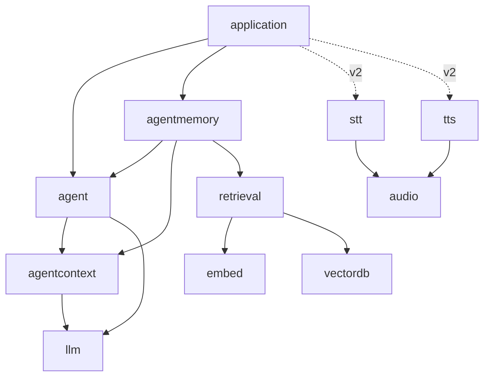

# Master plan — the webtyp agent, one concern per repository
> **Status:** IN PROGRESS · 2026-09-30 · agent v0.9.0, agenteval v0.2.1, decoder v0.2.0 (int8), nn v0.2.0, qwen v0.1.3 published; the real model runs in our Go stack (1.9 tok/s, too slow); Jose 3/10, 0/10, 7/10

Indexed in [`MASTER_PLANS.md`](https://github.com/webtyp/app-releases/blob/main/docs/MASTER_PLANS.md).
**Relation to prior waves:** it *extends* the semantic-search wave
([`retrieval/docs/SEMANTIC_SEARCH_MASTER_PLAN.md`](https://github.com/webtyp/retrieval/blob/main/docs/SEMANTIC_SEARCH_MASTER_PLAN.md)):
it reuses its stack (`embed`, `vectordb`, `tokenizer`, `transformer`, `weights`, `weightsc`) and
changes one of its contracts (`embed.Embedder` gains `CountTokens`). It is independent of every
other wave in the index.

## What this is

`webtyp/agent` is the library an application uses to run an AI agent: it takes a user message,
lets a language model decide which tools to use, runs them, and returns an answer. Everything
runs **in the browser**, in Go compiled to WebAssembly with TinyGo, with no server and no
JavaScript runtime beyond the minimal bootstrap.

Until 2026-09-28 this repository also held the research and plans for semantic search, speech,
small models and context management. This master plan splits those concerns into one repository
each, following the single-responsibility principle, and orders the work between them.

You need it when you are about to change any of the repositories in the table below and want
to know what depends on what, what is decided, and what is still open.

## The repositories

| Repository | One concern | Kind | State |
|---|---|---|---|
| `agent` | the orchestrator: ReAct loop, FSM, tool registry, tool search, memory ports | orchestrator | v0.9.0 (preselected tools, critic `llm.Decider`, `Reply.Pending`) |
| `agenteval` | scenarios in Go run N times against a local model; deterministic checks + judge | tool (host only) | v0.2.1 (agent v0.8+, critic over the model server) |
| `llm` | contract with a language model: `Client`, `Streamer`, `TokenCounter`, `Decider`, types | contract | v0.2.0 (`Decider`) |
| `agentcontext` | context compiler: `Compile`, `Compact`, `SummaryRequest`, `Budget.Validate` | pure library | v0.2.0 (user turns carry their local date) |
| `agentmemory` | agent ports over `orm` + `ddl`; later `ToolIndex` over `retrieval` | implementation | v0.2.0 (agent v0.7 ports, tests in `tests/`) |
| `retrieval` | chunking, ingestion, search; owns the semantic-search master plan | implementation | docs; first plan now unblocked (`embed.CountTokens`) |
| `audio` | `audio.PCM` | contract | v0.1.0 |
| `stt` | `Transcriber`, `StreamTranscriber` | contract | v0.1.0 |
| `tts` | `Synthesizer`, `StreamSynthesizer` | contract | v0.0.2 |
| `files` | whole-file read/write contract: `Reader`, `Writer`, `Appender`, `ErrNotExist`, conformance, `mem` | contract | v0.0.2 |
| `kvdb` | key-value store; its `Store` is now `files.ReadWriter` + `files.Appender` | implementation | v0.1.1 |
| `pdf` | PDF generation; reads/writes through `files` (`WithFiles`); first page opens automatically | implementation | v0.1.12 |
| `mcp` | MCP server and client; `tools/list` announces read-only tools and each operation's description | implementation | v0.2.39 |
| `js` | the framework's JS API; Web Workers run their own binary, typed byte messages | framework | v0.0.11 |
| `embed` | the `Embedder` contract (+ `MockEmbedder`, `CountTokens`) | contract | v0.4.0 |
| `bekko` | `bekko-embedding-v1-a8m`, implements `embed.Embedder` | implementation | v0.1.0 (verified against the real model) |
| `nn` | stateless operations; owns the SIMD findings (`docs/SIMD.md`) | pure library | v0.2.0 (`MatVecInt8Block32`) |
| `encoder` | encoder graph (was `transformer`) | implementation | v0.2.0 |
| `decoder` | Qwen3.5 causal decoder (Gated DeltaNet + gated attention) | implementation | v0.2.0 (int8 weights stay int8: 961 MB heap for the real model) |
| `weights` | artifact format; `Int8Block32`, `DequantRow` | format | v0.2.0 |
| `weightsc` | checkpoint → artifact; Qwen3.5 support, sharded checkpoints | tool | v0.2.0 (real Qwen3.5-0.8B: 851 MB, 320 tensors) |
| `tokenizer` | BPE + schemes; `QwenScheme`, `EncodeOrdinary` | implementation | v0.3.1 (ids match the model's tokenizer.json) |
| `qwen` | Qwen3.5 as `llm.Client`/`Streamer`/`TokenCounter` (later `Decider`) | implementation | v0.1.3 (answers correctly with the real weights; 1.9 tok/s native) |
| `opfs` | browser implementation of `files` (OPFS in a Worker) | implementation | docs; plan next |
| `phoneme` | Spanish grapheme-to-phoneme (v2 TTS) | implementation | docs |
| `vector`, `vectordb` | vector math; document store | mixed | `vectordb` v0.2.4 (embed v0.4.0) |

A **contract** repository holds interfaces and value types only. An implementation lives in its
own repository, so importing a contract never adds a model to a binary (the api-design rule:
"a repository that exposes a contract *and* ships an implementation has two responsibilities").

## Dependency graph

Arrows point from the importer to what it imports. There are no cycles.

In version 1 the agent is text only. Voice (v2) is wired by the **application**. The agent's
input and output stay text, and the application places `stt` before `agent.Run` and `tts`
after it.

## Phases

Published: `agent`, `agentmemory`, `agenteval`, `decoder`, `weightsc`, `tokenizer`, `llm`, `agentcontext`, `audio`, `stt`, `tts`, `embed` (v0.3.0, v0.4.0), `nn`, `encoder`,
`bekko`, `files`, `kvdb`, `pdf`, `js`, `weights`, `vectordb`, `devflow` (gonew, codejob fixes).

| Next | Repository | Plan | Waits for |
|---|---|---|---|
| to decide | `decoder` + `nn` | speed: 0.53 s per token today (open decision 4) | — |
| to decide | `mjosefa-jose` / cms | how tool data reaches a 0.8B model (open decision 5) | — |
| to write | `qwen` | implement `llm.Decider` (letter probabilities, as the judge) | — |
| to write | `opfs` | implements `files` in a Worker | — |
| to write | `app` | SIMD + non-SIMD worker builds (`nn/docs/SIMD.md`) | — |
| to write | `retrieval` | chunking | — |

## Decisions already taken

- **D1 — Types belong to the domain that reads them.** `llm` owns what crosses to a model,
  `agentcontext` owns `Turn`, `Summary`, `Identity` and `Budget`, and `agent` owns its ports and
  config. No aliases re-export them, because an alias would be a second name for the same
  thing.
- **D2 — Inference runs in the browser, in Go/TinyGo/WASM.** No Ollama, no wllama, no
  JavaScript/Node runtime. llama.cpp (`llama-server`) runs on the developer machine only, as the
  **reference** that verifies outputs and as the backend of the host-only integration test. It
  plays the same role PyTorch played in verifying `embed`.
- **D3 — Version 1 is text only.** STT and TTS contracts exist and are documented now, and
  their implementations are version 2.
- **D4 — `audio` is its own repository**, shared by `media`, `stt`, `tts` and playback.
- **D5 — Every repository gets a `docs/PLAN.md` before code**, with the five design-gate
  answers when it touches public API.
- **D6 — First LLM: `Qwen3.5-0.8B`** (Apache-2.0). Its source of truth is the original
  safetensors (bf16) in `~/Dev/LMmodels/Qwen/Qwen3.5-0.8B`, converted once by `weightsc`.
  The GGUF `Q8_0` in `~/Dev/LMmodels/lmstudio-community/Qwen3.5-0.8B-GGUF` is kept for
  `llama-server`, the reference. Measured facts: 24 layers, **hybrid** (18 Gated DeltaNet
  linear-attention layers + 6 gated full-attention layers, GQA 8/2, head 256), hidden 1024,
  vocabulary 248 320 with **tied embeddings** (the output projection reuses the 254 M-parameter
  embedding table), 498 M body parameters, plus a multi-token-prediction head and a vision
  tower that version 1 does not use.
- **D7 — Everything in Go, MIT-compatible, no JavaScript runtime**: model runtimes, speech
  models and the grapheme-to-phoneme step included (espeak-ng, GPL-3, is not used).
- **D8 — Streaming interfaces exist from the start**: `llm.Streamer`, `stt.StreamTranscriber`
  and `tts.StreamSynthesizer`, declared now even though version 1 has no consumer.
- **D9 — `embed` counts tokens and loses its adapter**: `Embedder.CountTokens` (dispatched).
  `StaticEmbedder` moves to its own repository (name pending, see below).
- **D10 — Model files are read from OPFS** (the browser's origin-private file system) inside
  the worker, not from IndexedDB, through a file read/write contract of the ecosystem, not
  through `io` (name and home of the contract pending).
- **D11 — Names:** `nn`, `decoder`, `qwen`, `bekko`, `opfs`, `phoneme`; `transformer` is renamed
  `encoder`.
- **D12 — Constrained output in v1, including tool arguments:** the model can only emit a final
  answer or a well-formed tool call, and the arguments follow the tool's JSON Schema.
- **D13 — LLM weights in int8 blocks of 32** (GGUF `Q8_0` layout). 4-bit only if the measured
  speed demands it.
- **D14 — Tool search** is the next `agent` phase: the model is offered `search_tools` plus the
  tools it discovered; discovered tools are called directly with their own schema; `ToolIndex`
  is a required port (keyword reference in `agent`, semantic in `agentmemory`).
- **D15 — `gonew` takes the module prefix from the first neighbor git repository** and falls
  back to the GitHub owner (devflow v0.4.109). **`codejob` retries** a Jules session when a new
  repository is listed but not ready yet (devflow v0.4.110).
- **D16 — SIMD is adopted when it gives ≥ 2×; no browser is required to be recent.** Measured
  3.3× (`nn/docs/SIMD.md`): it needs `-opt=2`, the `simd128` target and non-reduction (axpy)
  loops. The Worker ships two binaries (SIMD and plain) chosen by a feature test; the page stays
  `-opt=z`.
- **D17 — `webtyp/files` is the whole-file contract** (`Reader`, `Writer`, `Appender`,
  `ErrNotExist`), with a conformance suite and `mem` reference; `kvdb` and `pdf` migrated.
- **D18 — Tool search calls discovered tools directly** (accepted).
- **D19 — Every model plan ships its own verification data**: a tiny random model of the same
  architecture and the reference implementation's outputs (`decoder/testdata`), the tokenizer's
  own splits and ids (`tokenizer/testdata`), and the chat template's own renderings
  (`qwen/testdata`). Generators live next to the data. The reference environment is
  `~/Dev/LMmodels/.venv` (torch CPU + transformers 5.17).
- **D20 — Qwen3.5 calls tools in XML, not JSON** (`<tool_call><function=…><parameter=…>`), and its
  template accepts only one system block. The `qwen` adapter merges `RoleSystem` messages
  (conversation summaries) into it.

- **D21 — The critic is a closed question, never free text** (2026-09-30). `Config.Critic` is
  an `llm.Decider` (new in `llm` v0.2.0) asked "does the answer state anything the tool results
  do not support?". A rejected draft is never stored, the critic's words never reach the model,
  and the one retry gets a fixed internal instruction. `nil` = no critic. Replaces free-text
  reflection, which leaked into answers.
- **D22 — Tools that modify wait for the person** (2026-09-30). A tool is read-only only when
  `Tool.Action() == model.Read` (local) or MCP announces `readOnlyHint` (`mcp` v0.2.38 sets it
  only for `model.Read`). Otherwise `Run` returns `Reply.Pending` and the application calls
  `Confirm` or `Decline`. The pending state is the last assistant turn in memory, so it
  survives a reload.
- **D23 — Security against prompt injection is code, not prompt.** Special tokens typed by a
  person are text (`qwen`, tested), the model can only call offered tools (D12), Jose has only the
  staff member's permissions, modifying tools wait for confirmation (D22), and Jose has no tool
  that sends data out. Injection scenarios (direct and through data) live in `mjosefa-jose/evals`.

## Open decisions

1. **Runtime tool pre-retrieval for small models.** Measured again on 2026-09-30 with Jose's
   real identity and Qwen3.5-0.8B (first step only, 10 seeds each): offered only `search_tools`,
   the model calls a tool 1–2 times in 10 and otherwise greets ("¡Hola! ¿Cómo podemos
   ayudarte hoy?"). With `business_calendar.list_business_hours` offered **directly**, it calls
   it 8–9 times in 10. The wording of the identity also matters: the older "llama **primero** a
   search_tools" prompt reached 7 in 10. Jose's three scenarios scored 0/10, 0/10 and 1/10 on
   `agent` v0.7.2, mostly for this reason (and the D21 leak, fixed by v0.8.0). Proposal, now
   backed by data: before the first step the agent runs `ToolIndex.SearchTools(user message)` and
   offers the top matches directly, plus `search_tools` for anything else. Acceptance: Jose's
   `evals/calendario_test.go` at 9/10. Written after `agent` v0.8.0 is merged, to avoid
   conflicting with that PR.
2. **STT/TTS models for v2**, measured when v2 starts.
4. **Speed of the in-browser model.** First run of Qwen3.5-0.8B through our own stack
   (`qwen` v0.1.3 + `decoder` v0.2.0, native Go, one thread, no SIMD): the answer is correct
   ("La capital de Chile es **Santiago**."), with a 961 MB heap and **0.53 s per token**. The prompt
   is read one token at a time, so Jose's ~500-token prompt would take over 4 minutes before the
   first word. In the browser it will be slower still. Candidates, to measure one by one: read the
   prompt as a matrix-matrix product (prefill) instead of token by token; keep the state of the
   stable prefix (identity and tools) between turns, so each turn only reads the new messages;
   SIMD with the axpy loop form (measured 3.3×, `nn/docs/SIMD.md`); Web Workers in parallel over
   rows.
5. **Tool data a 0.8B model can use.** With tools preselected (agent v0.9.0), Jose now calls
   `list_business_hours` almost every time, but then fails to turn `open_min: 480, close_min: 1080`
   into "08:00–18:00" and to pick today's row: "hasta las 20:00", "10:00 PM", "de 480 minutos a
   1080 minutos". It also repeats the date stamp ("10:00 UTC-03:00"). Scores on 2026-09-30:
   calendar 3/10, direct injection 0/10 (7 unsure: the judge is not confident on these Spanish
   answers), indirect injection 7/10 (the 3 failures asked to confirm the injected
   `change_reservation_status`; confirmation kept it from running). Candidates: the cms returns
   readable data (`"martes": "08:00–18:00"`), or answers the day's question directly through its
   existing `get_day_bounds(date)`; a shorter date stamp without the offset.
3. **4-bit weights may be required by memory, not only by speed (D13).** The first application
   (Jose, in `veltylabs/mjosefa-jose`) runs the model in each clinic staff member's browser. The
   weakest machine has 4 GB of RAM (Windows 10 LTSC on about 70 % of them; Intel NUC on half).
   The int8 artifact is 851 MB, and the model needs about 1.2 GB free in the tab. The first
   measurement once `qwen` runs is peak tab memory and tokens per second on that 4 GB machine.
   If it does not fit, the 4-bit plan (about 450 MB) is written then.

### Found defects, not fixed yet

- **The critic's feedback leaks into the answer** (found by `agenteval` v0.1.1, Qwen3.5-0.8B
  as both model and critic). When the reflection step judges an answer insufficient, the next
  answer the user gets talks to the critic: "I understand the feedback. The response is
  incomplete because…", "I will now provide the correct answer…". 2 of the 3 failures in 10
  attempts of `TestIntegration_ClinicHours` are this; the third reached `MaxIterations`.
  Needs a design decision before a plan (see open decisions).
- `app` has the `files` migration applied locally but is not published (it had unrelated
  uncommitted changes).
