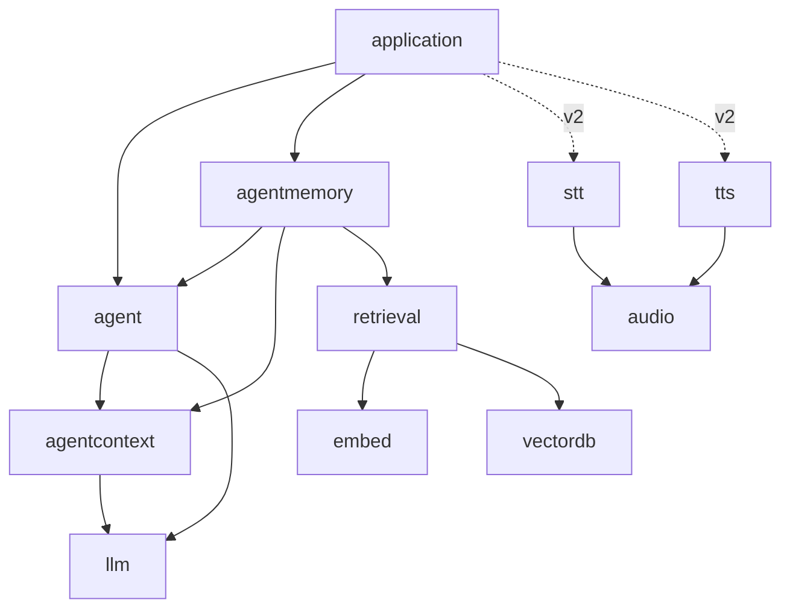

# Master plan — the webtyp agent, one concern per repository
> **Status:** IN PROGRESS · 2026-09-29 · agent v0.6.0, decoder v0.1.0, tokenizer v0.3.0, weightsc v0.2.0 published; qwen and agentmemory unblocked

Indexed in [`MASTER_PLANS.md`](https://github.com/webtyp/app-releases/blob/main/docs/MASTER_PLANS.md).
**Relation to prior waves:** it *extends* the semantic-search wave
([`retrieval/docs/SEMANTIC_SEARCH_MASTER_PLAN.md`](https://github.com/webtyp/retrieval/blob/main/docs/SEMANTIC_SEARCH_MASTER_PLAN.md)):
it reuses its stack (`embed`, `vectordb`, `tokenizer`, `transformer`, `weights`, `weightsc`) and
changes one of its contracts (`embed.Embedder` gains `CountTokens`). It is independent of every
other wave in the index.

## What this is

`webtyp/agent` is the library an application uses to run an AI agent: it takes a user message,
lets a language model decide which tools to use, runs them, and returns an answer. Everything
runs **in the browser**, in Go compiled to WebAssembly with TinyGo, with no server and no
JavaScript runtime beyond the minimal bootstrap.

Until 2026-09-28 this repository also held the research and plans for semantic search, speech,
small models and context management. This master plan splits those concerns into one repository
each, following the single-responsibility principle, and orders the work between them.

You need it when you are about to change any of the repositories in the table below and want
to know what depends on what, what is decided, and what is still open.

## The repositories

| Repository | One concern | Kind | State |
|---|---|---|---|
| `agent` | the orchestrator: ReAct loop, FSM, tool registry, tool search, memory ports | orchestrator | v0.6.0 (integration test against real Qwen3.5 via llama-server) |
| `llm` | contract with a language model: `Client`, `Streamer`, `TokenCounter`, types | contract | v0.1.0 |
| `agentcontext` | context compiler: `Compile`, `Compact`, `SummaryRequest`, `Budget.Validate` | pure library | v0.1.0 |
| `agentmemory` | agent ports over `orm` + `ddl`; later `ToolIndex` over `retrieval` | implementation | phase 3b plan written (waits for agent v0.6.0) |
| `retrieval` | chunking, ingestion, search; owns the semantic-search master plan | implementation | docs; first plan now unblocked (`embed.CountTokens`) |
| `audio` | `audio.PCM` | contract | v0.1.0 |
| `stt` | `Transcriber`, `StreamTranscriber` | contract | v0.1.0 |
| `tts` | `Synthesizer`, `StreamSynthesizer` | contract | v0.0.2 |
| `files` | whole-file read/write contract: `Reader`, `Writer`, `Appender`, `ErrNotExist`, conformance, `mem` | contract | v0.0.2 |
| `kvdb` | key-value store; its `Store` is now `files.ReadWriter` + `files.Appender` | implementation | v0.1.1 |
| `pdf` | PDF generation; reads/writes through `files` (`WithFiles`); first page opens automatically | implementation | v0.1.12 |
| `js` | the framework's JS API; Web Workers run their own binary, typed byte messages | framework | v0.0.11 |
| `embed` | the `Embedder` contract (+ `MockEmbedder`, `CountTokens`) | contract | v0.4.0 |
| `bekko` | `bekko-embedding-v1-a8m`, implements `embed.Embedder` | implementation | v0.1.0 (verified against the real model) |
| `nn` | stateless operations; owns the SIMD findings (`docs/SIMD.md`) | pure library | v0.1.0 |
| `encoder` | encoder graph (was `transformer`) | implementation | v0.2.0 |
| `decoder` | Qwen3.5 causal decoder (Gated DeltaNet + gated attention) | implementation | v0.1.0 (float32, matches reference ≤ 1e-4, 0 allocs per Step) |
| `weights` | artifact format; `Int8Block32`, `DequantRow` | format | v0.2.0 |
| `weightsc` | checkpoint → artifact; Qwen3.5 support, sharded checkpoints | tool | v0.2.0 (real Qwen3.5-0.8B: 851 MB, 320 tensors) |
| `tokenizer` | BPE + schemes; `QwenScheme`, `EncodeOrdinary` | implementation | v0.3.1 (ids match the model's tokenizer.json) |
| `qwen` | Qwen3.5 as `llm.Client`/`Streamer`/`TokenCounter` | implementation | plan written, **unblocked** |
| `opfs` | browser implementation of `files` (OPFS in a Worker) | implementation | docs; plan next |
| `phoneme` | Spanish grapheme-to-phoneme (v2 TTS) | implementation | docs |
| `vector`, `vectordb` | vector math; document store | mixed | `vectordb` v0.2.4 (embed v0.4.0) |

A **contract** repository holds interfaces and value types only. An implementation lives in its
own repository, so importing a contract never adds a model to a binary (the api-design rule:
"a repository that exposes a contract *and* ships an implementation has two responsibilities").

## Dependency graph

Arrows point from the importer to what it imports. There are no cycles.

In version 1 the agent is text only. Voice (v2) is wired by the **application**. The agent's
input and output stay text, and the application places `stt` before `agent.Run` and `tts`
after it.

## Phases

Published: `llm`, `agentcontext`, `audio`, `stt`, `tts`, `embed` (v0.3.0, v0.4.0), `nn`, `encoder`,
`bekko`, `files`, `kvdb`, `pdf`, `js`, `weights`, `vectordb`, `devflow` (gonew, codejob fixes).

| Next | Repository | Plan | Waits for |
|---|---|---|---|
| running | `agent` | `agent/docs/PLAN.md` (queue: refactor + tool search) | — |
| running | `decoder` | `decoder/docs/PLAN.md` (correctness, float32) | — |
| running | `weightsc` | `weightsc/docs/PLAN.md` (Qwen3.5, int8-block32) | — |
| running | `tokenizer` | `tokenizer/docs/PLAN.md` (`QwenScheme`, `EncodeOrdinary`) | — |
| written | `agentmemory` | `agentmemory/docs/PLAN.md` | `agent` v0.6.0 |
| written | `qwen` | `qwen/docs/PLAN.md` | `tokenizer` v0.3.0, `decoder` v0.1.0 |
| to write | `decoder` v0.2.0 | Int8Block32 weights + axpy (SIMD form) | `decoder` v0.1.0 |
| to write | `opfs` | implements `files` in a Worker | — |
| to write | `app` | SIMD + non-SIMD worker builds (`nn/docs/SIMD.md`) | — |
| to write | `retrieval` | chunking | — |

## Decisions already taken

- **D1 — Types belong to the domain that reads them.** `llm` owns what crosses to a model,
  `agentcontext` owns `Turn`, `Summary`, `Identity` and `Budget`, and `agent` owns its ports and
  config. No aliases re-export them, because an alias would be a second name for the same
  thing.
- **D2 — Inference runs in the browser, in Go/TinyGo/WASM.** No Ollama, no wllama, no
  JavaScript/Node runtime. llama.cpp (`llama-server`) runs on the developer machine only, as the
  **reference** that verifies outputs and as the backend of the host-only integration test. It
  plays the same role PyTorch played in verifying `embed`.
- **D3 — Version 1 is text only.** STT and TTS contracts exist and are documented now, and
  their implementations are version 2.
- **D4 — `audio` is its own repository**, shared by `media`, `stt`, `tts` and playback.
- **D5 — Every repository gets a `docs/PLAN.md` before code**, with the five design-gate
  answers when it touches public API.
- **D6 — First LLM: `Qwen3.5-0.8B`** (Apache-2.0). Its source of truth is the original
  safetensors (bf16) in `~/Dev/LMmodels/Qwen/Qwen3.5-0.8B`, converted once by `weightsc`.
  The GGUF `Q8_0` in `~/Dev/LMmodels/lmstudio-community/Qwen3.5-0.8B-GGUF` is kept for
  `llama-server`, the reference. Measured facts: 24 layers, **hybrid** (18 Gated DeltaNet
  linear-attention layers + 6 gated full-attention layers, GQA 8/2, head 256), hidden 1024,
  vocabulary 248 320 with **tied embeddings** (the output projection reuses the 254 M-parameter
  embedding table), 498 M body parameters, plus a multi-token-prediction head and a vision
  tower that version 1 does not use.
- **D7 — Everything in Go, MIT-compatible, no JavaScript runtime**: model runtimes, speech
  models and the grapheme-to-phoneme step included (espeak-ng, GPL-3, is not used).
- **D8 — Streaming interfaces exist from the start**: `llm.Streamer`, `stt.StreamTranscriber`
  and `tts.StreamSynthesizer`, declared now even though version 1 has no consumer.
- **D9 — `embed` counts tokens and loses its adapter**: `Embedder.CountTokens` (dispatched).
  `StaticEmbedder` moves to its own repository (name pending, see below).
- **D10 — Model files are read from OPFS** (the browser's origin-private file system) inside
  the worker, not from IndexedDB, through a file read/write contract of the ecosystem, not
  through `io` (name and home of the contract pending).
- **D11 — Names:** `nn`, `decoder`, `qwen`, `bekko`, `opfs`, `phoneme`; `transformer` is renamed
  `encoder`.
- **D12 — Constrained output in v1, including tool arguments:** the model can only emit a final
  answer or a well-formed tool call, and the arguments follow the tool's JSON Schema.
- **D13 — LLM weights in int8 blocks of 32** (GGUF `Q8_0` layout). 4-bit only if the measured
  speed demands it.
- **D14 — Tool search** is the next `agent` phase: the model is offered `search_tools` plus the
  tools it discovered; discovered tools are called directly with their own schema; `ToolIndex`
  is a required port (keyword reference in `agent`, semantic in `agentmemory`).
- **D15 — `gonew` takes the module prefix from the first neighbor git repository** and falls
  back to the GitHub owner (devflow v0.4.109). **`codejob` retries** a Jules session when a new
  repository is listed but not ready yet (devflow v0.4.110).
- **D16 — SIMD is adopted when it gives ≥ 2×; no browser is required to be recent.** Measured
  3.3× (`nn/docs/SIMD.md`): it needs `-opt=2`, the `simd128` target and non-reduction (axpy)
  loops. The Worker ships two binaries (SIMD and plain) chosen by a feature test; the page stays
  `-opt=z`.
- **D17 — `webtyp/files` is the whole-file contract** (`Reader`, `Writer`, `Appender`,
  `ErrNotExist`), with a conformance suite and `mem` reference; `kvdb` and `pdf` migrated.
- **D18 — Tool search calls discovered tools directly** (accepted).
- **D19 — Every model plan ships its own verification data**: a tiny random model of the same
  architecture and the reference implementation's outputs (`decoder/testdata`), the tokenizer's
  own splits and ids (`tokenizer/testdata`), and the chat template's own renderings
  (`qwen/testdata`). Generators live next to the data. The reference environment is
  `~/Dev/LMmodels/.venv` (torch CPU + transformers 5.17).
- **D20 — Qwen3.5 calls tools in XML, not JSON** (`<tool_call><function=…><parameter=…>`), and its
  template accepts only one system block. The `qwen` adapter merges `RoleSystem` messages
  (conversation summaries) into it.

## Open decisions

1. **Runtime tool pre-retrieval for small models.** Measured with Qwen3.5-0.8B: the model calls
   `search_tools`, the index finds the right tool, and the model then answers from memory
   instead of calling it. Each tool hop succeeds ~50–65% of the time, and tool search needs two.
   Proposal: before the first step, the agent itself runs `ToolIndex.SearchTools(user message)`
   and offers the top matches directly (plus `search_tools` for anything else). That removes one
   hop. `agent/integration_test.go` `TestIntegration_ClinicHours` is the acceptance test.
2. **STT/TTS models for v2**, measured when v2 starts.

### Found defects, not fixed yet

- none open (the `pdf` first-page defect is fixed in v0.1.11; `goflare`'s unused `Store` was removed).
- `app` has the `files` migration applied locally but is not published (it had unrelated
  uncommitted changes).
