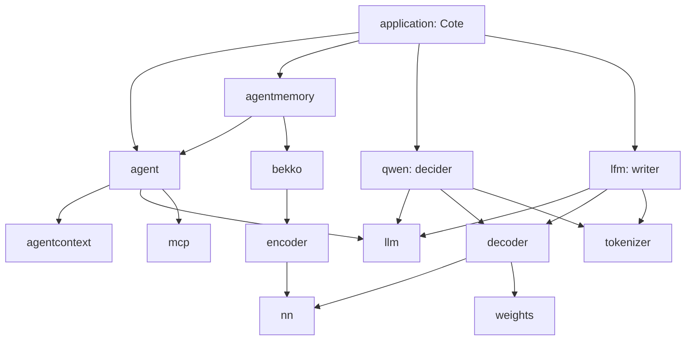

# Master plan — the webtyp agent, one concern per repository
> **Status:** IN PROGRESS · 2026-10-05 · published: agent v1.1.0, agenteval v0.4.0 (laboratory), agentworker v0.1.5, **weights v0.4.0 + nn v0.5.0 (4-bit)**; on Jules: weightsc and decoder (4-bit); first real tests in agenteval/docs/REAL_TESTS.md; the assistant is **Cote** (`veltylabs/mjosefa-cote`)

Indexed in [`MASTER_PLANS.md`](https://github.com/webtyp/app-releases/blob/main/docs/MASTER_PLANS.md).
**Relation to prior waves:** it *extends* the semantic-search wave
([`retrieval/docs/SEMANTIC_SEARCH_MASTER_PLAN.md`](https://github.com/webtyp/retrieval/blob/main/docs/SEMANTIC_SEARCH_MASTER_PLAN.md)):
it reuses its stack (`embed`, `vectordb`, `tokenizer`, `encoder`, `weights`, `weightsc`) and
changed one of its contracts (`embed.Embedder` gained `CountTokens`). It is independent of every
other wave in the index.

## Start here (next session)

This page is the context of the agent wave. The PWA and device work (capabilities, shell cache,
heavy artifacts) is a **separate wave**:
[app/docs/PWA_ARTIFACTS_MASTER_PLAN.md](https://github.com/webtyp/app/blob/main/docs/PWA_ARTIFACTS_MASTER_PLAN.md),
with its open decisions answered in `app/docs/PLAN_DRAFT.md`. Do not mix the two.

In order:

1. **Cold start hangs** after the last download (`call to released function` in the Worker; the
   four files are complete in OPFS, a reload starts in 9 s). Find which JS callback is released
   early on the download → read path (`fetch`, `await`, `opfs`, `agentworker`); a library fix gets
   a plan first.
2. **4-bit blocks** (2026-10-05: the real test measured **2.9 GB** of tab memory with int8). Four
   plans, GGUF Q4_0 layout with float32 scales:
   **published** `weights` v0.4.0 (`Int4Block32`, `QuantizeInt4Block32`, `DequantInt4Block32`;
   implemented locally, the Jules PR carried only the plan) and `nn` v0.5.0 (`MatVecQ4Block32`:
   ≈ 1.11× the int8 kernel's time for half the memory, plain and SIMD); **on Jules**
   `weightsc` (`-quant int4-block32`) and `decoder` (int4 `matrix`). Then,
   locally: convert decider-0.8b and LFM2.5-350M to int4, decider must keep ≥ 32/36 on the 36
   questions, and remeasure the tab in agenteval's laboratory.
3. **Speed:** the first answer took ≈ 4 min (tool-list prefix + writer), later ones ≈ 18 s. Measure
   the second start with the saved decision cache (D27), and plain vs SIMD.
4. **Text arguments** (D2): the agent fills every string argument with the whole message
   (`change_business_hours` got it as `day`, `opens` and `closes`). Needs a design before Cote's
   modifying tools are used.
5. **Cote in the laboratory:** `mjosefa-cote` gets its own `web/client.go` (page with
   `agenteval/ui`) and `web/workers/cote/main.go` (Cote's Setup, `business_calendar` over
   `mcp.NewLocalClient`). Then `mjosefa-cote/docs/PLAN.md` (scenarios on agenteval v0.3.0, now
   unblocked).
6. Cote inside `mjosefa-cms` — **not yet** (owner, 2026-10-02): after Cote's tests in the lab.

Lessons from the v1.0.0 round (2026-10-01):

- A Jules PR with only docs can mean the session failed and the resumed one lost the code. The
  code is in the session's activities (`GET /v1alpha/sessions/<id>/activities`,
  `artifacts[].changeSet.gitPatch`): the last patch before `sessionFailed` applies on the PR
  branch. agent v1.0.0 was recovered this way, not rewritten.
- Review found Jules editing production code to fit a hand-written test mock (reverted); tests
  against a real `mcp.Server` caught D28.

## What this is

`webtyp/agent` is the library an application uses to run an AI agent: it takes a person's
message, decides which tool answers it, runs the tool, and returns an answer. Everything runs
**in the browser**, in Go compiled to WebAssembly with TinyGo, with no server and no JavaScript
runtime beyond the minimal bootstrap.

Since 2026-09-30 the agent is **hybrid** ([HYBRID_DESIGN.md](HYBRID_DESIGN.md)): code checks the
message first, a small **decision model** (decider-0.8b) picks among given options (which tool,
yes or no), code runs the tools, and the answer comes from the application's templates or, when
phrasing is needed, a small **writer** model (LFM2.5-350M). No model writes a tool call.

The first application is **Cote**, the assistant of Consultorio María Josefa
(`veltylabs/mjosefa-cote`): it runs in each staff member's browser, with that person's
permissions, on PCs that can have as little as 4 GB of RAM.

You need this page when you are about to change any repository in the table below and want to
know what depends on what, what is decided, and what comes next.

## The repositories

| Repository | One concern | Kind | Version |
|---|---|---|---|
| `agent` | the orchestrator: the hybrid turn, tool registry, confirmation, memory ports | orchestrator | **v1.1.0** (hybrid; `MCPClients`) |
| `agenteval` | scenarios in Go run N times against local models (decider + writer on llama-server, judge decider-4b); **the laboratory**: `ui/` (chat panel over agentworker), `lab/` (test agent, model files), `cmd/lab` (release build + HTTPS) | tool + lab | v0.4.0 |
| `llm` | contract with a model: `Client`, `Streamer`, `TokenCounter`, `Decider` | contract | v0.2.2 |
| `agentcontext` | context compiler: `Compile`, `Compact`, `SummaryRequest`, `Stamp` | pure library | v0.3.1 |
| `agentmemory` | agent ports over `orm` + `ddl`; `ToolIndex` by meaning (bekko) | implementation | v0.3.2 |
| `qwen` | Qwen3.5 family: `llm.Client` and **`llm.Decider`** (decider-0.8b), prefix caches; `DecidePrompt` (the measured wording, one source) | implementation | v0.4.7 |
| `lfm` | LFM2 family: LFM2.5-350M as the **writer** (`llm.Client`, no tools) | implementation | v0.1.2 |
| `decoder` | causal decoder: Qwen3.5 (DeltaNet + attention) and LFM2 (short conv + attention) | implementation | v0.5.1 |
| `nn` | stateless kernels; `MatVecQ8Block32` (int8×int8), SIMD and performance findings | pure library | v0.4.2 |
| `tokenizer` | BPE + schemes (`QwenScheme`, `Lfm2Scheme`, …), `ParseMerges`, `Stream` (whole UTF-8 characters) | implementation | v0.4.2 |
| `weights`, `weightsc` | artifact format (`Int8Block32`) and checkpoint → artifact converter | format, tool | v0.2.0 |
| `json` | JSON without reflection; `Keys` for objects whose names are data | implementation | v0.5.27 |
| `mcp` | MCP server and client (HTTP, or in process with `NewLocalClient`); `tools/list` announces read-only tools and descriptions | implementation | v0.2.40 |
| `router` | the app's routes; `Describe` on operations (what tools say about themselves) | implementation | v0.3.1 |
| `embed`, `bekko`, `encoder` | embedding contract, the bekko model, the encoder graph | contract, implementations | v0.4.0, v0.1.9, v0.2.4 |
| `files` | whole-file contract: `Reader`, `Writer`, `Appender`, conformance, `mem` | contract | v0.0.2 |
| `opfs` | browser implementation of `files` (OPFS, chunked async API, page and Worker) | implementation | v0.1.0 |
| `js` | the framework's JS API; Web Workers run their own binary | framework | v0.0.11 |
| `retrieval`, `vector`, `vectordb` | chunking and search; vector math; document store | implementations | v0.0.1, v0.1.1, v0.2.4 |
| `audio`, `stt`, `tts`, `phoneme` | voice (version 2) | contracts, implementation | v0.1.0, v0.1.0, v0.0.2, v0.0.1 |
| `kvdb`, `pdf` | other `files` consumers | implementations | v0.1.2, v0.1.14 |
| `agentworker` | the agent inside a Web Worker: device check, downloads to OPFS, decision cache, typed events | implementation | v0.1.5 |
| `veltylabs/mjosefa-cote` | Cote: `Texts`, `Guard`, `Templates()` (today's hours), `Config(Deps)` | configuration | v0.2.0 |

A **contract** repository holds interfaces and value types only. An implementation lives in its
own repository, so importing a contract never adds a model to a binary.

## Dependency graph

Arrows point from the importer to what it imports. There are no cycles.

`agent` never imports a model: the application passes a `llm.Decider` and a `llm.Client`. Voice
(v2) is wired by the application around `agent.Run`.

## Phases

| Next | Repository | Plan | Waits for |
|---|---|---|---|
| done | `weights` v0.4.0, `nn` v0.5.0 | `Int4Block32` + quantizer; `MatVecQ4Block32` | — |
| on Jules | `weightsc`, `decoder` | `-quant int4-block32`; int4 `matrix` | — |
| next | `fetch`/`await`/`opfs`/`agentworker` | cold-start hang (`call to released function`) | — |
| next | `mjosefa-cote` | Cote in agenteval's laboratory (`web/workers/cote`) | — |
| ready | `mjosefa-cote` | scenarios on agenteval v0.3.0 (`docs/PLAN.md`); the direct injection now expects a refusal (D26) | — |
| later | `mjosefa-cms` | Cote's chat in the CMS over its MCP endpoint (same origin, the staff session cookie) | Cote's tests in the lab |
| moved | `device`, `app`, `js` | tier detection by feature test (D25) now belongs to the PWA wave (`webtyp/device`) | PWA master plan |
| later | `qwen`, `lfm` | one shared prefix cache instead of one per model family (`lfm` has none yet) | — |
| later | `nn`, `decoder` | profile the scalar remainder under WASM (SIMD gives 2× end to end, not the kernel's 4.3×) | — |
| later | `agent` | narrow `MemoryStore` (summaries, knowledge unused in v1); dates and RUT arguments by code (D2) | agent v1.0.0 |

## Decisions

### Standing

- **D1 — Types belong to the domain that reads them.** `llm` owns what crosses to a model,
  `agentcontext` owns `Turn`, `Summary`, `Identity`, `Budget`; `agent` owns its ports and config.
  No aliases re-export them.
- **D2 — Inference runs in the browser, in Go/TinyGo/WASM.** No Ollama, no wllama, no JS runtime.
  llama.cpp (`llama-server`) runs on the developer machine only, as the **reference** and for
  `agenteval`.
- **D3 — Version 1 is text only.** STT and TTS contracts exist; implementations are version 2.
- **D4 — `audio` is its own repository.**
- **D5 — Every repository gets a `docs/PLAN.md` before code**, with the design gate when it
  touches public API. Plans are exact, with premises verified against code and data.
- **D7 — Everything in Go, MIT-compatible** (espeak-ng, GPL-3, is not used).
- **D8 — Streaming interfaces exist from the start** (`llm.Streamer`, `stt.StreamTranscriber`,
  `tts.StreamSynthesizer`).
- **D10 — Model files are read from OPFS** inside the Worker, through `webtyp/files` (D17).
- **D13 — Weights in int8 blocks of 32** (GGUF `Q8_0` layout); **4-bit blocks decided** for the
  4 GB machines (HYBRID_DESIGN D6: decider Q4 529 MB + writer ≈ 230 MB).
- **D15 — `gonew` and `codejob`** take the module prefix from a neighbor repository and retry a
  new repository not ready yet; the dispatch prompt forbids questions and frontmatter edits
  (devflow v0.4.116); closing a plan always pushes the PR branch first, so review corrections
  already committed are not lost (devflow v0.4.119).
- **D16 — SIMD is adopted when it gives ≥ 2×.** The Worker ships a SIMD and a plain binary.
- **D17 — `webtyp/files` is the whole-file contract**, with conformance and `mem`.
- **D19 — Every model plan ships its own verification data**: a tiny random model of the same
  architecture and the reference outputs, the tokenizer's splits and ids, the chat template's
  renderings. Generators live next to the data. Reference environment: `~/Dev/LMmodels/.venv`.
- **D21 — The critic is a closed question, never free text** (`llm.Decider`).
- **D22 — Tools that modify wait for the person.** Read-only only when `Action() == model.Read`
  or MCP `readOnlyHint`; otherwise `Reply.Pending` and `Confirm`/`Decline`. The pending state is
  the last assistant turn in memory, so it survives a reload.
- **D23 — Security is code, not prompt.** Typed control tokens stay text (`qwen`, `lfm`), Cote has
  only the staff member's permissions, modifying tools wait for confirmation, no tool sends data
  out. Injection scenarios live in `mjosefa-cote/evals`.
- **D24 — The agent is hybrid, one form only** (2026-09-30). The decision model drives the turn;
  code computes and calls tools; templates in the application answer known questions;
  LFM2.5-350M writes when phrasing is needed. ReAct is removed. Every question to the decision
  model uses the wording measured in `agenteval/testdata/slm` (table in HYBRID_DESIGN).
- **D25 — Every device runs the agent; better hardware only makes it faster** (2026-10-01).
  Tier 1 plain WebAssembly, tier 2 SIMD128, tier 3 WebGPU, picked by feature test. Measured
  end to end for decider-0.8b: a cached tool choice takes 5.3–6.6 s (tier 1) and 2.6–3.2 s
  (tier 2); details in [nn/docs/PERFORMANCE.md](https://github.com/webtyp/nn/blob/main/docs/PERFORMANCE.md).
- **D26 — Code checks every message before any model** (2026-10-01, HYBRID_DESIGN D7). It removes
  invisible characters, refuses messages over `Guard.MaxChars`, and refuses messages with chat
  markers, role lines or the application's phrases. The decision model's injection question runs
  only on risky turns (before a modifying tool waits, before the writer reads data).
- **D27 — The decision prefix survives a restart** (2026-10-01). `qwen.SaveDecisionCache` /
  `LoadDecisionCache` over `decoder.State.MarshalBinary`: the tool list read once (22–44 s) is
  kept by the Worker in OPFS (≈ 19 MB) and loaded on the next start.
- **D28 — An MCP tool's result is its text** (2026-10-01, agent v1.0.0). The registry returns the
  first text block (`mcp.GetText`), not the raw `content` array: templates and the person read it
  directly. Content that is not text is passed as is.
- **D29 — Tools in process go through MCP too** (2026-10-02, mcp v0.2.40, agent v1.1.0). Where
  the tools live next to the agent (a Worker holding the modules, a demo, a test),
  `mcp.NewLocalClient(server, userID)` is the MCP client without HTTP and
  `agent.Config.MCPClients` takes it. One path from a module's operations to the agent, the same
  in the lab and in the CMS. Prior art: the MCP Go SDK's in-memory transports.
- **D30 — agenteval asks the decider with the browser's prompt** (2026-10-02, qwen v0.4.7).
  `qwen.DecidePrompt` returns the pieces qwen tokenizes one by one; agenteval tokenizes the same
  pieces on llama-server and reads the letters at temperature 1.03. Its previous chat-template
  prompt measured a different question.
- **D31 — Agents are tested in agenteval's laboratory, not in `mjosefa-cms`** (owner, 2026-10-02,
  revised 2026-10-05). The laboratory lives in `webtyp/agenteval` (`ui/`, `web/client.go`,
  `web/workers/agent`, `cmd/lab`), the same repo as the scenarios; a separate `agentlab`
  repository was created and removed. An application's agent (Cote) is tested by mounting
  `agenteval/ui` with its own Worker. The CMS integration waits for those tests.

### Superseded (kept as a record)

- **D6 — First LLM: Qwen3.5-0.8B** → the decision model is decider-0.8b (a Qwen3.5-0.8B
  fine-tune) and the writer LFM2.5-350M (D24).
- **D12 — Constrained output, including tool arguments**, still holds inside `qwen` generation,
  but the agent no longer asks any model for a tool call (D24).
- **D14, D18 — Tool search through `search_tools`** → candidate tools come from `ToolIndex` and
  the decision model chooses among them (D24).
- **D20 — Qwen3.5 tool calls in XML** stays true of `qwen`; the agent no longer uses it.

## Measurements that decided the design

| What | Result | Where |
|---|---|---|
| decision models vs small chat models on 36 closed questions | decider-0.8b 32–34/36; chat models under 1B ≈ 11/36 | [llm/docs/EFFICIENT_SLM.md](https://github.com/webtyp/llm/blob/main/docs/EFFICIENT_SLM.md) |
| writers under 0.5B, Spanish answers from data | LFM2.5-350M 10/10 extraction, best of its size | same |
| our runtime vs transformers | LFM2.5-350M greedy 20/20 tokens; decider-0.8b 34/36 | decoder, qwen |
| tool candidates by meaning vs keywords | top-3 14/16 vs 11/16 | agentmemory |
| speed, browser engine | see D25 | nn/docs/PERFORMANCE.md |

## Open

1. **STT/TTS models for v2**, measured when v2 starts.
2. **Peak tab memory on the 4 GB machine** with decider Q4 + writer, once 4-bit blocks exist.
3. **Enum arguments** (`Which value of "…" does the message ask for?`) are not measured yet; the
   first scenario with an enum tool measures it in `agenteval`.

### Found defects, not fixed yet

- Cold start: the Worker hangs after the last download with `call to released function`
  (agenteval/docs/REAL_TESTS.md, 2026-10-05).
- `dom` v0.13.19 made `Show` take a builder and `components` is not migrated: agenteval pins
  `dom` v0.13.18 with a `replace` until it is.
- The development daemon (`webtyp dev`) does not build `web/workers/`: the laboratory needs
  `go run ./cmd/lab` to talk to the agent.
- `app` has the `files` migration applied locally but is not published (it had unrelated
  uncommitted changes).
