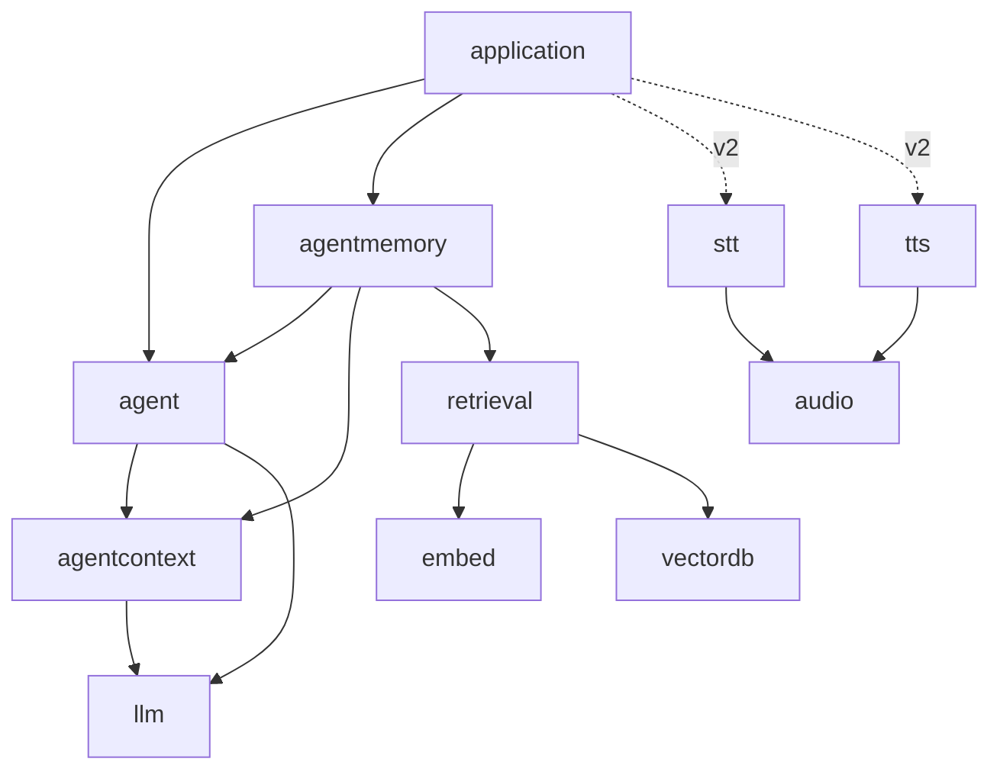
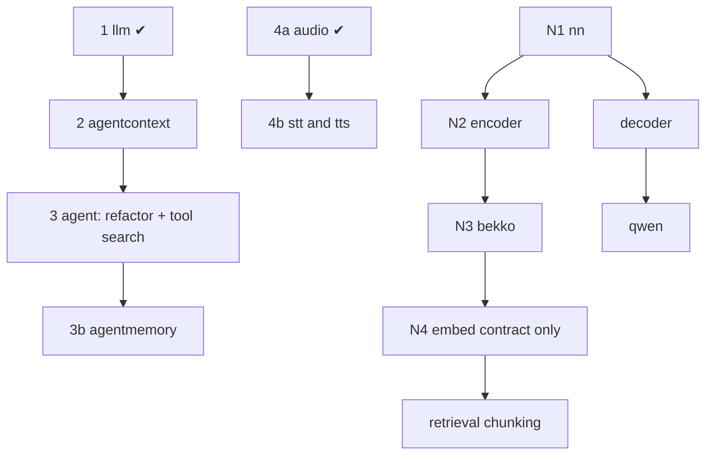

# Master plan — the webtyp agent, one concern per repository
> **Status:** IN PROGRESS · 2026-09-29 · llm, audio, embed v0.3.0 published; agentcontext, stt, nn running

Indexed in [`MASTER_PLANS.md`](https://github.com/webtyp/app-releases/blob/main/docs/MASTER_PLANS.md).
**Relation to prior waves:** it *extends* the semantic-search wave
([`retrieval/docs/SEMANTIC_SEARCH_MASTER_PLAN.md`](https://github.com/webtyp/retrieval/blob/main/docs/SEMANTIC_SEARCH_MASTER_PLAN.md)):
it reuses its stack (`embed`, `vectordb`, `tokenizer`, `transformer`, `weights`, `weightsc`) and
changes one of its contracts (`embed.Embedder` gains `CountTokens`). It is independent of every
other wave in the index.

## What this is

`webtyp/agent` is the library an application uses to run an AI agent: it takes a user message,
lets a language model decide which tools to use, runs them, and returns an answer. Everything
runs **in the browser**, in Go compiled to WebAssembly with TinyGo, with no server and no
JavaScript runtime beyond the minimal bootstrap.

Until 2026-09-28 this repository also held the research and plans for semantic search, speech,
small models and context management. This master plan splits those concerns into one repository
each, following the single-responsibility principle, and orders the work between them.

You need it when you are about to change any of the repositories in the table below and want
to know what depends on what, what is decided, and what is still open.

## The repositories

| Repository | One concern | Kind | State |
|---|---|---|---|
| `agent` | the orchestrator: ReAct loop, FSM, tool registry, tool search, memory ports | orchestrator | v0.5; phase 3 queue written (blocked on `agentcontext`) |
| `llm` | the contract with a language model: `Client`, `Streamer`, `TokenCounter`, message/request/response types | contract | **v0.1.0 published** |
| `agentcontext` | the context compiler: what the model sees each turn, within a token budget | pure library | **running** (phase 2) |
| `agentmemory` | the agent's ports implemented over `orm` + `ddl` (SQL or IndexedDB), later `ToolIndex` over `retrieval` | implementation | v0.1; phase 3b plan written |
| `retrieval` | chunking, ingestion and search; owns the semantic-search master plan | implementation | docs only; first plan waits for `bekko`/`embed` split |
| `audio` | `audio.PCM`, the sound value shared by voice pieces | contract | **v0.1.0 published** |
| `stt` | speech-to-text contract (`Transcriber`, `StreamTranscriber`) | contract | **running** |
| `tts` | text-to-speech contract (`Synthesizer`, `StreamSynthesizer`) | contract | plan written, unblocked |
| `embed` | the `Embedder` contract (+ `MockEmbedder`) | contract | **v0.3.0 published** (`CountTokens`); v0.4.0 plan deletes `StaticEmbedder` |
| `bekko` | `bekko-embedding-v1-a8m`, implements `embed.Embedder` (was `embed.StaticEmbedder`) | implementation | plan written (waits for `encoder`) |
| `nn` | stateless operations: matmul, norms, activations, softmax, RoPE | pure library | **running** |
| `encoder` | the encoder graph (was `transformer`; GitHub already renamed) | implementation | plan written (waits for `nn`) |
| `decoder` | the causal decoder graph: full attention + Gated DeltaNet, KV/recurrent state | implementation | docs only |
| `qwen` | Qwen3.5: implements `llm.Client`/`Streamer`/`TokenCounter`; chat template, tool calls, constrained output | implementation | docs only |
| `opfs` | browser implementation of the file read/write contract (OPFS, in a Worker) | implementation | docs only; contract name pending |
| `phoneme` | Spanish grapheme-to-phoneme in Go (MIT, no espeak) for v2 TTS | implementation | docs only |
| `vector`, `vectordb`, `tokenizer`, `weights`, `weightsc` | the semantic-search stack | mixed | published; `vectordb` must add `CountTokens` to its test double when it bumps `embed` |

A **contract** repository holds interfaces and value types only. An implementation lives in its
own repository, so importing a contract never adds a model to a binary (the api-design rule:
"a repository that exposes a contract *and* ships an implementation has two responsibilities").

## Dependency graph

Arrows point from the importer to what it imports. There are no cycles.

In version 1 the agent is text only. Voice (v2) is wired by the **application**. The agent's
input and output stay text, and the application places `stt` before `agent.Run` and `tts`
after it.

## Phases

| Phase | Repository | Plan | Waits for | State |
|---|---|---|---|---|
| 1 | `llm` | — | — | published v0.1.0 |
| 2 | `agentcontext` | `agentcontext/docs/PLAN.md` | `llm` ✔ | running |
| 3 | `agent` | [`PLAN.md`](PLAN.md) (queue: llm/agentcontext refactor, then tool search) | `agentcontext` v0.1.0 | written |
| 3b | `agentmemory` | `agentmemory/docs/PLAN.md` | `agent` v0.6.0 | written |
| 4a | `audio` | — | — | published v0.1.0 |
| 4b | `stt`, `tts` | each `docs/PLAN.md` | `audio` ✔ | `stt` running, `tts` ready |
| E1 | `embed` `CountTokens` | — | — | published v0.3.0 |
| N1 | `nn` | `nn/docs/PLAN.md` | — | running |
| N2 | `encoder` (rename) | `encoder/docs/PLAN.md` | `nn` v0.1.0 | written |
| N3 | `bekko` | `bekko/docs/PLAN.md` | `encoder` v0.2.0 | written |
| N4 | `embed` v0.4.0 (contract only) | `embed/docs/PLAN.md` | `bekko` v0.1.0 | written |
| — | `retrieval`, `decoder`, `qwen`, `opfs`, `weights`/`weightsc` Q8, `webtyp/js` workers | not written | open decisions below | |

## Decisions already taken

- **D1 — Types belong to the domain that reads them.** `llm` owns what crosses to a model,
  `agentcontext` owns `Turn`, `Summary`, `Identity` and `Budget`, and `agent` owns its ports and
  config. No aliases re-export them, because an alias would be a second name for the same
  thing.
- **D2 — Inference runs in the browser, in Go/TinyGo/WASM.** No Ollama, no wllama, no
  JavaScript/Node runtime. llama.cpp (`llama-server`) runs on the developer machine only, as the
  **reference** that verifies outputs and as the backend of the host-only integration test. It
  plays the same role PyTorch played in verifying `embed`.
- **D3 — Version 1 is text only.** STT and TTS contracts exist and are documented now, and
  their implementations are version 2.
- **D4 — `audio` is its own repository**, shared by `media`, `stt`, `tts` and playback.
- **D5 — Every repository gets a `docs/PLAN.md` before code**, with the five design-gate
  answers when it touches public API.
- **D6 — First LLM: `Qwen3.5-0.8B`** (Apache-2.0). Its source of truth is the original
  safetensors (bf16) in `~/Dev/LMmodels/Qwen/Qwen3.5-0.8B`, converted once by `weightsc`.
  The GGUF `Q8_0` in `~/Dev/LMmodels/lmstudio-community/Qwen3.5-0.8B-GGUF` is kept for
  `llama-server`, the reference. Measured facts: 24 layers, **hybrid** (18 Gated DeltaNet
  linear-attention layers + 6 gated full-attention layers, GQA 8/2, head 256), hidden 1024,
  vocabulary 248 320 with **tied embeddings** (the output projection reuses the 254 M-parameter
  embedding table), 498 M body parameters, plus a multi-token-prediction head and a vision
  tower that version 1 does not use.
- **D7 — Everything in Go, MIT-compatible, no JavaScript runtime**: model runtimes, speech
  models and the grapheme-to-phoneme step included (espeak-ng, GPL-3, is not used).
- **D8 — Streaming interfaces exist from the start**: `llm.Streamer`, `stt.StreamTranscriber`
  and `tts.StreamSynthesizer`, declared now even though version 1 has no consumer.
- **D9 — `embed` counts tokens and loses its adapter**: `Embedder.CountTokens` (dispatched).
  `StaticEmbedder` moves to its own repository (name pending, see below).
- **D10 — Model files are read from OPFS** (the browser's origin-private file system) inside
  the worker, not from IndexedDB, through a file read/write contract of the ecosystem, not
  through `io` (name and home of the contract pending).
- **D11 — Names:** `nn`, `decoder`, `qwen`, `bekko`, `opfs`, `phoneme`; `transformer` is renamed
  `encoder`.
- **D12 — Constrained output in v1, including tool arguments:** the model can only emit a final
  answer or a well-formed tool call, and the arguments follow the tool's JSON Schema.
- **D13 — LLM weights in int8 blocks of 32** (GGUF `Q8_0` layout). 4-bit only if the measured
  speed demands it.
- **D14 — Tool search** is the next `agent` phase: the model is offered `search_tools` plus the
  tools it discovered; discovered tools are called directly with their own schema; `ToolIndex`
  is a required port (keyword reference in `agent`, semantic in `agentmemory`).
- **D15 — `gonew` takes the module prefix from the first neighbor git repository** and falls
  back to the GitHub owner (devflow v0.4.109). **`codejob` retries** a Jules session when a new
  repository is listed but not ready yet (devflow v0.4.110).

## Open decisions

Each open decision blocks the plans named after it. The questions and recommendations are asked
in conversation; this list only tracks what is still open.

1. **The file read/write contract**: its name and repository. Blocks `opfs`, `qwen`, and a
   `pdf` migration.
2. **SIMD in `nn`**: whether to add a second, vectorized implementation. It blocks the speed
   stage, not correctness.
3. **Tool search shape**: the design is to call discovered tools directly. A generic
   `execute_tool(name, args)` is the alternative the user first described. Blocks dispatching
   phase 3.
4. **`decoder` / `qwen` / Q8 `weights` plans**: they need the Gated DeltaNet reference and the
   Qwen3.5 tokenizer pre-tokenizer spelled out. Written after decisions 1–2.
5. **Web Worker messaging in `webtyp/js`** (approved: typed `[]byte` messages, transferable).
   The plan is not written yet.
6. **STT/TTS models for v2**, measured when v2 starts.
