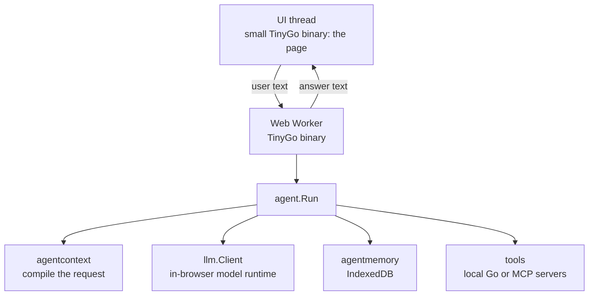
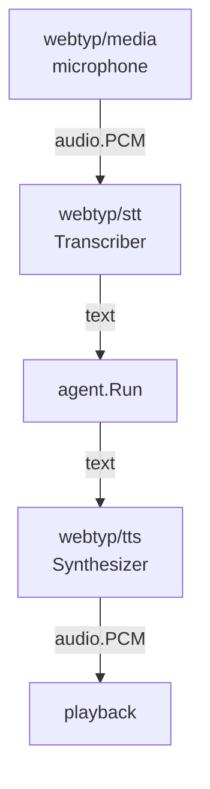

# Architecture — `webtyp/agent`

## What this is

`agent` is the **orchestrator** of the webtyp ecosystem. It runs the loop that turns a user
message, a set of tools and a language model into an answer. The model reasons, the agent runs
the tools the model asks for, feeds the results back, and repeats until the model answers.

You use it from an application. You give it a model, a memory store and tools in a `Config`,
and call `agent.Run(ctx, sessionID, text)`.

It is designed to run **inside the browser**, in Go compiled to WebAssembly with TinyGo, next
to the rest of the webtyp stack. It also compiles for a server. It owns no backend and no model.
Both are injected, so one agent binary works with any of them.

## Principles

- **Deterministic control.** A finite-state machine (FSM) decides which step can follow which.
  The model chooses *what* to do, and code decides *whether that is allowed now*.
- **Dependency injection.** The model (`llm.Client`), its tokenizer (`llm.TokenCounter`),
  memory (`MemoryStore`) and tools are interfaces. `New(cfg)` is the only place concrete
  types meet.
- **One concern per repository.** The agent orchestrates. Deciding what the model sees is
  `webtyp/agentcontext`, the model contract is `webtyp/llm`, storage is `webtyp/agentmemory`,
  and search is `webtyp/retrieval`. See the
  [ecosystem master plan](AGENT_ECOSYSTEM_MASTER_PLAN.md).
- **Session isolation.** Every memory read and write is scoped by `sessionID`. Global
  knowledge (empty session) is readable from every session. Knowledge private to a session
  is never visible from another.
- **Observability.** Every tool execution is logged (`ToolLogStore`) with input, output, error
  and duration.

## Where it runs



The whole agent, including the model, memory and search, runs in one Web Worker. The page
itself stays a small binary that only sends text and shows the answer. A long inference then
never freezes the UI, and the page does not download model code before it can render. How the
worker and the model runtime are built is an open decision in the
[ecosystem master plan](AGENT_ECOSYSTEM_MASTER_PLAN.md).

## Components

| Component | File(s) | Responsibility |
|---|---|---|
| Constructor | `agent.go` | validates `Config`, applies defaults, connects tools. It is the only wiring point |
| Orchestrator | `orchestrator.go`, `turn.go` | the ReAct + reflection loop, memory I/O, calls to the models |
| FSM | `fsm.go` | valid state transitions |
| Tool registry | `mcp_registry.go`, `mcp_client.go`, `mcp_json.go` | merges local tools, in-process MCP handlers and remote MCP servers |
| Memory ports | `interfaces.go` | `ConversationStore`, `SummaryStore`, `KnowledgeStore`, `ToolLogStore` |
| Reference memory | `mem_memory.go` | in-memory `MemoryStore` for tests and demos (no persistence) |
| Conformance suite | `conformance/` | the tests every `MemoryStore` implementation must pass |

Value types: [TYPES.md](TYPES.md).

## The loop

1. `Run` stores the user's message as a `Turn`.
2. **Reasoning:** load recent turns and summaries. If they no longer fit the budget, summarize
   the oldest ones (`agentcontext.Compact`). Then build the request (`agentcontext.Compile`)
   and call the primary model.
3. **Acting:** if the model asked for tools (`llm.StopToolUse`), run them. Errors become
   observations the model can correct from, not failures.
4. **Reflecting:** when the model answers (`llm.StopEndTurn`), a second, cheap call judges the
   answer `SUFFICIENT` or `INSUFFICIENT`. An insufficient answer goes back to reasoning with the
   critique.
5. **Responding:** return the answer. `MaxIterations` and `MaxRetries` bound the loop. A model
   cut off at its output limit (`llm.StopMaxTokens`) returns an explicit error.

Diagrams: [ReAct flow](diagrams/REACT_FLOW.md) · [FSM](diagrams/FSM_STATE.md) ·
[MCP client](diagrams/MCP_CLIENT_FLOW.md) · [memory](diagrams/MEMORY_ARCHITECTURE.md) ·
[system context](diagrams/SYSTEM_CONTEXT.md) · [tool search](diagrams/TOOL_SEARCH.md) · [integration scenario](diagrams/INTEGRATION_SCENARIO.md).
The context window, step by step, is documented where the logic lives:
[`agentcontext/docs/diagrams/CONTEXT_WINDOW.md`](https://github.com/webtyp/agentcontext/blob/main/docs/diagrams/CONTEXT_WINDOW.md).

## Contracts

```go
// Memory: declared here, implemented by webtyp/agentmemory (or the application).
type ConversationStore interface {
	EnsureSession(ctx *context.Context, sessionID string) error
	AppendTurn(ctx *context.Context, sessionID string, t agentcontext.Turn) error
	GetTurns(ctx *context.Context, sessionID string, limit int) ([]agentcontext.Turn, error)
	DeleteTurns(ctx *context.Context, sessionID string, ids []string) error
}
type SummaryStore interface {
	SaveSummary(ctx *context.Context, sessionID string, s agentcontext.Summary) error
	GetSummaries(ctx *context.Context, sessionID string, limit int) ([]agentcontext.Summary, error)
}
type KnowledgeStore interface {
	SaveKnowledge(ctx *context.Context, sessionID, content, source string) error
	SearchKnowledge(ctx *context.Context, query, sessionID string, limit int) ([]Knowledge, error)
}
type ToolLogStore interface {
	LogToolCall(ctx *context.Context, sessionID, toolName, inputJSON, outputText, errText string, durationMS int64) error
	GetToolLogs(ctx *context.Context, sessionID, toolName string, limit int) ([]ToolLog, error)
}
type MemoryStore interface { ConversationStore; SummaryStore; KnowledgeStore; ToolLogStore }

// Tools.
type Tool interface {
	Name() string
	Description() string
	InputSchema() string
	Execute(ctx *context.Context, argsJSON string) (string, error)
}
type MCPServer interface{ URL() string }
```

The model contract (`llm.Client`, `llm.TokenCounter`) is in
[`webtyp/llm`](https://github.com/webtyp/llm). `SearchKnowledge` takes **text**, never a
vector. Turning text into a vector is the memory implementation's job.

## Confirmation before tools that modify

When the model decides to call a tool that alters data (any tool whose action is not `model.Read`), the agent pauses execution before calling the tool and returns the pending tool calls in `Reply.Pending`. The calling application presents these calls to the user for explicit confirmation or rejection:

```go
reply, err := a.Run(ctx, sessionID, "Cancel my appointment")
if len(reply.Pending) > 0 {
    // Show reply.Pending to the user and prompt for confirmation
    reply, err = a.Confirm(ctx, sessionID) // or a.Decline(ctx, sessionID)
}
```

If the user typed a new query instead of confirming, calling `Run` automatically declines the pending actions before processing the new query.

## Tools

Three sources are merged at construction:

| Source | Config field | Execution | Use |
|---|---|---|---|
| Local | `LocalTools []Tool` | direct Go call | pure functions, internal state |
| Handler | `MCPHandlers []MCPServer` | JSON-RPC 2.0 to `URL()` | MCP servers running in the same process |
| Remote | `MCPServers []string` | JSON-RPC 2.0 over HTTP | external MCP servers |

**Tool search:** The model is not shown every tool. Each step offers `search_tools(query)` plus
the tools discovered so far in this `Run`. When the model searches, a `ToolIndex` (a port:
`NewMemToolIndex` here ranks by keywords, and `webtyp/agentmemory` ranks by meaning over
`webtyp/retrieval`) returns the matching tools. Those tools become callable **directly**,
with their real JSON Schema, so the model runtime can constrain the arguments. A tool that was
not discovered is refused. This keeps the request small for a small model. The reasoning is in
[`agentcontext/docs/CONTEXT_ENGINEERING.md`](https://github.com/webtyp/agentcontext/blob/main/docs/CONTEXT_ENGINEERING.md),
and the flow is in [TOOL_SEARCH](diagrams/TOOL_SEARCH.md).

## Voice (version 2)

Version 1 is text only. In version 2 the **application** wraps the agent, and the agent's
input and output stay text:


