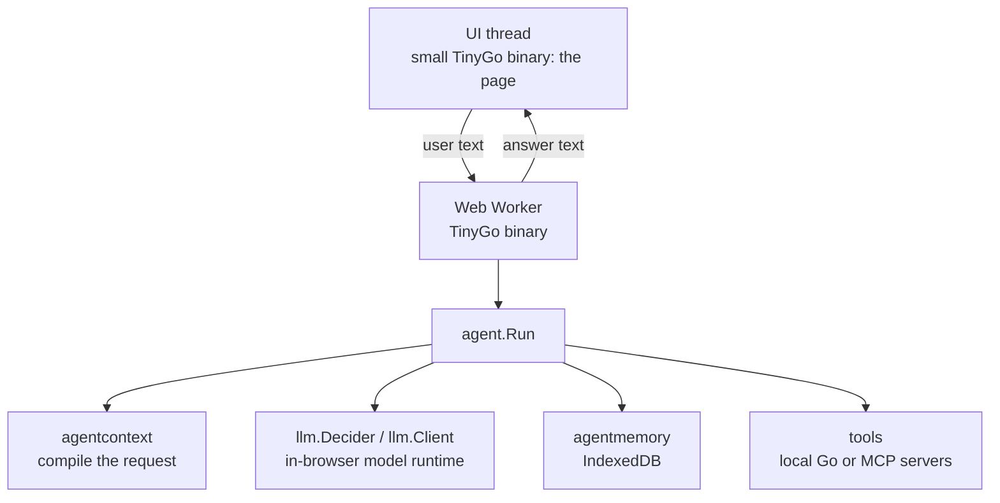

# Architecture — `webtyp/agent`

## What this is

`agent` is the **orchestrator** of the webtyp ecosystem. It drives the hybrid turn that turns a user
message, a set of tools, a code guard, a decision model, and optional templates or a writer model into an answer.

You use it from an application. You give it a decision model (`llm.Decider`), texts, templates, guard settings, a memory store and tools in a `Config`,
and call `agent.Run(ctx, sessionID, text)`.

It is designed to run **inside the browser**, in Go compiled to WebAssembly with TinyGo, next
to the rest of the webtyp stack. It also compiles for a server. It owns no backend and no model.
Both are injected, so one agent binary works with any of them.

## Principles

- **Deterministic control.** A code guard (`Guard`) filters messages first.
- **Decision Model.** A decision model (`llm.Decider`) picks tools from options, answers enums, yes/no questions, injection checks, and critic validation. It never generates free-form text.
- **Dependency injection.** The decision model (`llm.Decider`), writer (`llm.Client`), its tokenizer (`llm.TokenCounter`),
  memory (`MemoryStore`) and tools are interfaces. `New(cfg)` is the only place concrete
  types meet.
- **One concern per repository.** The agent orchestrates. Deciding what the model sees is
  `webtyp/agentcontext`, the model contract is `webtyp/llm`, storage is `webtyp/agentmemory`,
  and search is `webtyp/retrieval`. See the
  [ecosystem master plan](AGENT_ECOSYSTEM_MASTER_PLAN.md).
- **Session isolation.** Every memory read and write is scoped by `sessionID`. Global
  knowledge (empty session) is readable from every session. Knowledge private to a session
  is never visible from another.
- **Observability.** Every tool execution is logged (`ToolLogStore`) with input, output, error
  and duration.

## Where it runs



The whole agent, including the models, memory and search, runs in one Web Worker. The page
itself stays a small binary that only sends text and shows the answer. A long inference then
never freezes the UI, and the page does not download model code before it can render.

## Components

| Component | File(s) | Responsibility |
|---|---|---|
| Constructor | `agent.go` | validates `Config`, applies defaults, connects tools, checks templates. It is the only wiring point |
| Turn execution | `turn.go` | drives the hybrid flow, memory I/O, tool execution, route, and answer resolution |
| Code guard | `guard.go` | cleans text, checks character limits, chat markers, system roles, and phrase rules |
| Decision helper | `decide.go` | questions sent to `llm.Decider` (routing, injection, yes/no, enums, critic) |
| Tool arguments | `arguments.go` | constructs JSON inputs for tools from `InputSchema` using enums or raw message string |
| Tool registry | `mcp_registry.go`, `mcp_client.go`, `mcp_json.go` | merges local tools, in-process MCP handlers and remote MCP servers |
| Memory ports | `interfaces.go` | `ConversationStore`, `SummaryStore`, `KnowledgeStore`, `ToolLogStore` |
| Reference memory | `mem_memory.go` | in-memory `MemoryStore` for tests and demos (no persistence) |
| Conformance suite | `conformance/` | the tests every `MemoryStore` implementation must pass |

Value types: [TYPES.md](TYPES.md).

## The turn

1. **Guard check:** `Guard.check(msg)` cleans invisible characters and checks length limits, chat markers, system role lines, and forbidden phrases. If flagged, returns `Texts.Refused` or `Texts.TooLong`.
2. **Routing:** `ToolIndex` selects candidate tools. `llm.Decider` chooses the best fitting tool or "none".
3. **Arguments:** Arguments are constructed deterministically or via enum decisions.
4. **Safety & Confirmation:** If the tool modifies data (not read-only), an injection check runs. If clear, the tool call is put on hold as `Reply.Pending` for user `Confirm` or `Decline`.
5. **Tool execution & Answer:** Read-only tools run directly. The answer is obtained from yes/no fact reasoning, template matching, optional writer generation (`llm.Client`) with critic review, or raw data output (`Texts.Found`).

Diagrams: [MCP client](diagrams/MCP_CLIENT_FLOW.md) · [memory](diagrams/MEMORY_ARCHITECTURE.md) · [system context](diagrams/SYSTEM_CONTEXT.md).

## Contracts

```go
// Memory: declared here, implemented by webtyp/agentmemory (or the application).
type ConversationStore interface {
	EnsureSession(ctx *context.Context, sessionID string) error
	AppendTurn(ctx *context.Context, sessionID string, t agentcontext.Turn) error
	GetTurns(ctx *context.Context, sessionID string, limit int) ([]agentcontext.Turn, error)
	DeleteTurns(ctx *context.Context, sessionID string, ids []string) error
}
type SummaryStore interface {
	SaveSummary(ctx *context.Context, sessionID string, s agentcontext.Summary) error
	GetSummaries(ctx *context.Context, sessionID string, limit int) ([]agentcontext.Summary, error)
}
type KnowledgeStore interface {
	SaveKnowledge(ctx *context.Context, sessionID, content, source string) error
	SearchKnowledge(ctx *context.Context, query, sessionID string, limit int) ([]Knowledge, error)
}
type ToolLogStore interface {
	LogToolCall(ctx *context.Context, sessionID, toolName, inputJSON, outputText, errText string, durationMS int64) error
	GetToolLogs(ctx *context.Context, sessionID, toolName string, limit int) ([]ToolLog, error)
}
type MemoryStore interface { ConversationStore; SummaryStore; KnowledgeStore; ToolLogStore }

// Tools.
type Tool interface {
	Name() string
	Description() string
	InputSchema() string
	Action() model.Action
	Execute(ctx *context.Context, argsJSON string) (string, error)
}
type MCPServer interface{ URL() string }
```

## Loops a small model falls into

In hybrid mode, generative loops are avoided by design because routing and argument selection are controlled by deterministic code and bounded options evaluated by `llm.Decider`.

## Confirmation before tools that modify

When the model decides to call a tool that alters data (any tool whose action is not `model.Read`), the agent pauses execution before calling the tool and returns the pending tool calls in `Reply.Pending`. The calling application presents these calls to the user for explicit confirmation or rejection:

```go
reply, err := a.Run(ctx, sessionID, "Cancel my appointment")
if len(reply.Pending) > 0 {
    // Show reply.Pending to the user and prompt for confirmation
    reply, err = a.Confirm(ctx, sessionID) // or a.Decline(ctx, sessionID)
}
```

If the user typed a new query instead of confirming, calling `Run` automatically declines the pending actions before processing the new query.

## Tools

Three sources are merged at construction:

| Source | Config field | Execution | Use |
|---|---|---|---|
| Local | `LocalTools []Tool` | direct Go call | pure functions, internal state |
| Handler | `MCPHandlers []MCPServer` | JSON-RPC 2.0 to `URL()` | MCP servers running in the same process |
| Remote | `MCPServers []string` | JSON-RPC 2.0 over HTTP | external MCP servers |
