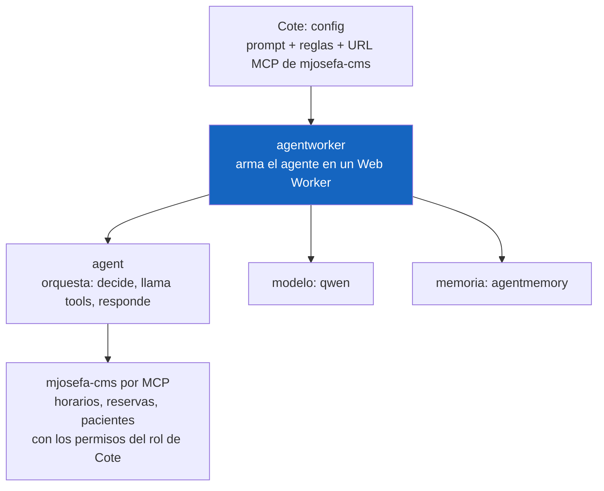
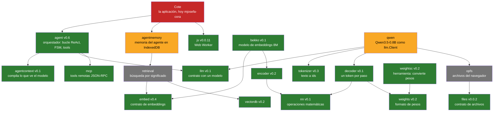
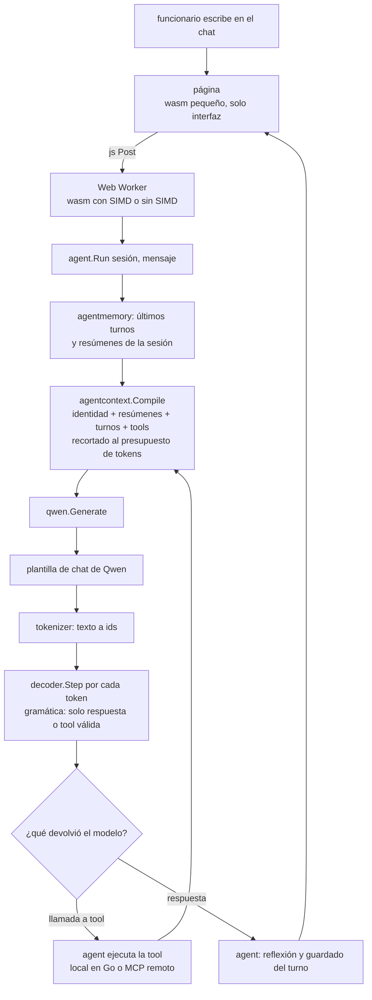
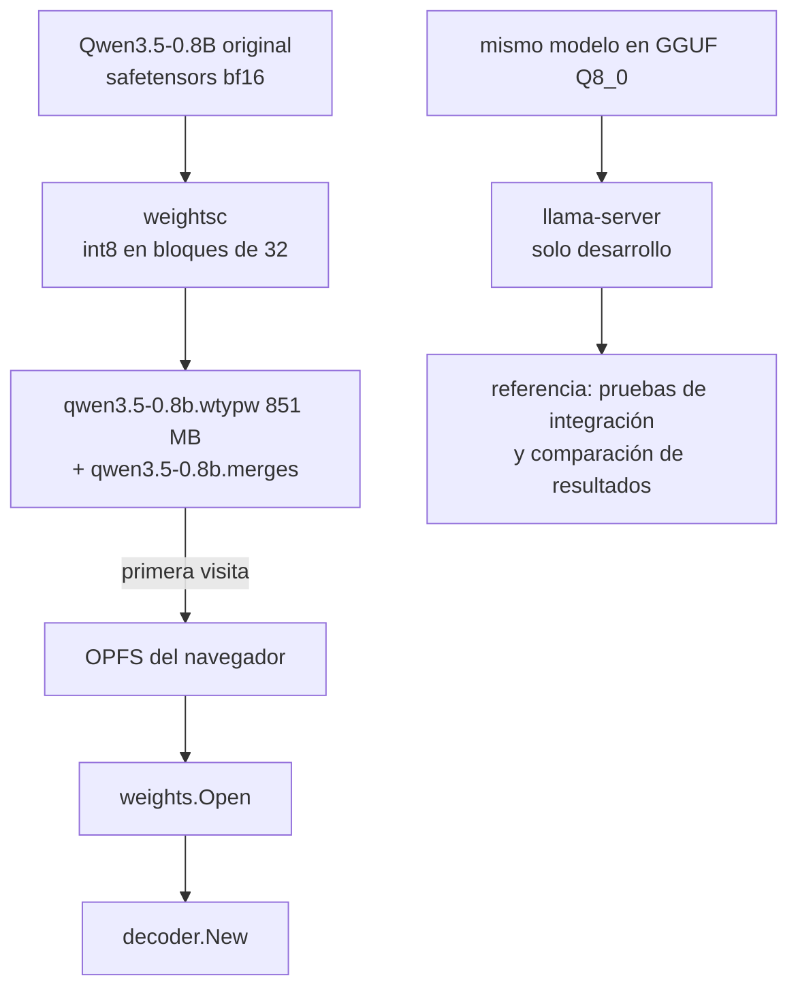
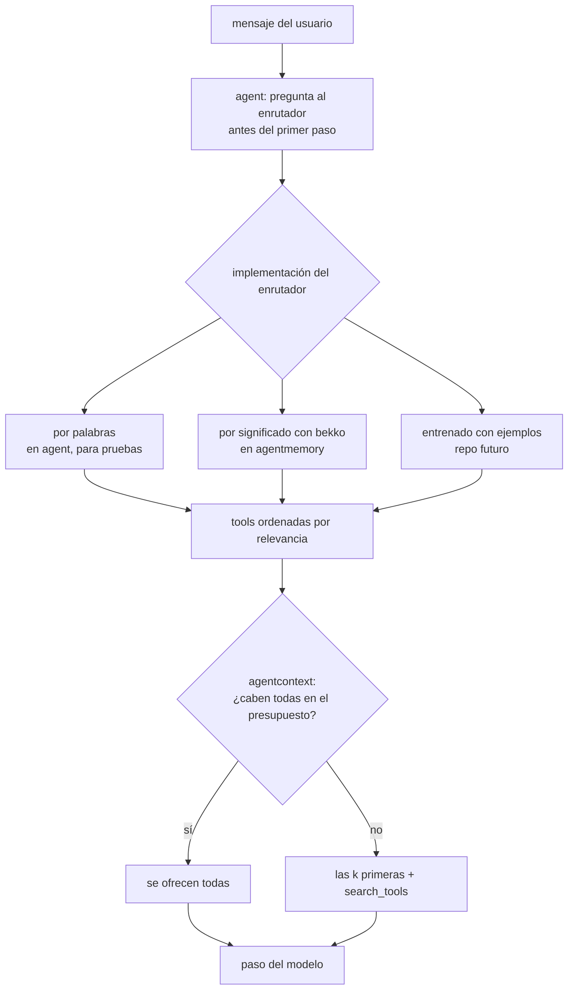
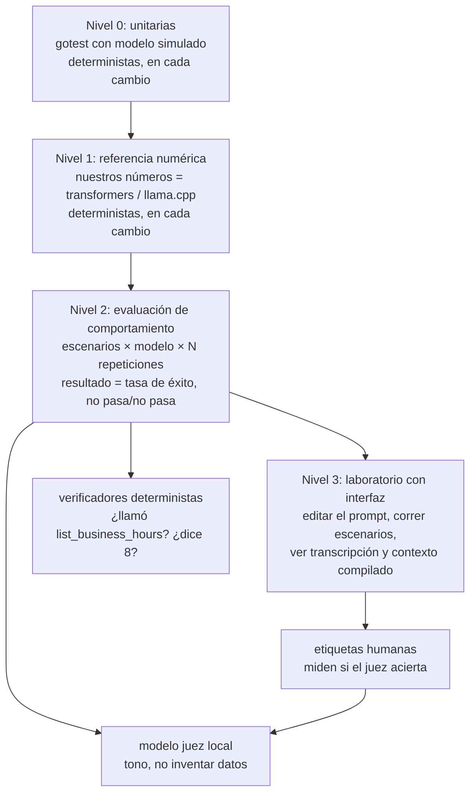

# Mapa del ecosistema del agente

Esta página muestra **qué piezas existen, cómo se conectan y en qué estado está cada una**, para
quien necesita entender el proyecto sin haber seguido su construcción. Un *agente* es un programa
que recibe un mensaje, deja que un modelo de lenguaje decida qué herramientas (*tools*) usar, las
ejecuta y devuelve una respuesta. En webtyp todo eso corre **dentro del navegador**, en Go
compilado a WebAssembly (WASM) con TinyGo, sin servidor de inferencia.

Los colores indican el estado de cada repositorio:

- **verde:** publicado y probado;
- **amarillo:** tiene plan escrito, pero no código;
- **gris:** solo documentación;
- **rojo:** hay que realinearlo.

Las secciones 0, 4 y 5 son **propuestas pendientes de decisión**.

## 0. Lo que ve Cote (la aplicación)

Cote es el asistente del consultorio María Josefa. Su código solo debe **configurar**: quién es
Cote (el prompt), con qué servidor de tools habla y qué modelo usa. `agent` no puede elegir por
sí mismo el modelo ni la memoria: es una librería que también debe servir para otras
aplicaciones, otros modelos y servidores. Alguien tiene que crear esas piezas concretas y
entregárselas. Ese "alguien" es una pieza reutilizable que arma el agente dentro de un Web
Worker, y así cada aplicación no repite el mismo armado.

## 1. Repositorios por capa

Cada flecha va de quien importa a lo importado. Un repositorio **contrato** solo declara
interfaces y tipos. Una **implementación** cumple un contrato. Una **herramienta** corre en la
máquina del desarrollador, nunca en el navegador.

`stt`, `tts`, `audio` y `phoneme` (voz, versión 2) no aparecen en el diagrama porque la versión 1
es solo texto. Sus contratos ya están publicados.

## 2. Qué pasa con un mensaje

Un funcionario le escribe a Cote "¿hasta qué hora atendemos hoy?". La página solo dibuja. El modelo corre en un
*Web Worker*, un hilo aparte del navegador, para que la página no se congele mientras el modelo
piensa.

## 3. De dónde salen los pesos del modelo

Los pesos se convierten **una vez**, en la máquina del desarrollador. El navegador los descarga
una sola vez y los guarda en OPFS, el sistema de archivos privado del sitio. `llama-server` no
forma parte del producto: es la **referencia** con la que se verifica que nuestro código da los
mismos números.

## 4. Propuesta: dónde entra el enrutador de tools

**Estado: pendiente de decisión.** Un *enrutador* (router) decide qué tools le mostramos al
modelo para este mensaje. Hoy el modelo debe pedirlas él mismo con `search_tools`, y un modelo de
0,8B se pierde en ese salto extra. La propuesta separa tres responsabilidades:

- **agent** pregunta, porque es el único que hace entrada/salida;
- **el enrutador** ordena las tools por relevancia;
- **agentcontext** decide cuántas caben.

## 5. Propuesta: niveles de prueba

**Estado: pendiente de decisión.** Probar un agente no es igual que probar una función, porque el
modelo no siempre responde lo mismo. Por eso hay cuatro niveles, y solo los dos primeros son
pruebas de pasa/no pasa en cada cambio.

