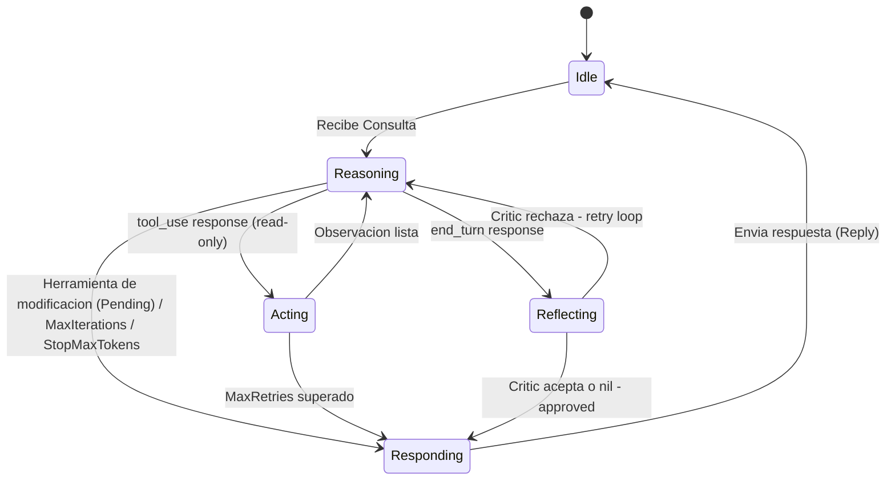

# Agent FSM State Machine

This diagram defines the **Finite State Machine (FSM)** that governs the agent's execution. The FSM enforces deterministic control: the LLM decides *what* to do next, but the code defines *which transitions are valid* in each state.

## Diagram

## State Definitions

| State | Role | Description |
|-------|------|-------------|
| **Idle** | Entry/Exit | Waiting for input. No active work. Session context is not loaded yet. |
| **Reasoning** | Core loop | The LLM is processing the current context window and deciding the next action. Produces either a `tool_use` or `end_turn` response. |
| **Acting** | Execution | The orchestrator executes one or more read-only tool calls requested by the LLM. |
| **Reflecting** | Quality gate | A typed critic (`llm.Decider`) checks if the answer states anything unsupported by tool results. |
| **Responding** | Output | The final answer (or pending calls) is returned to the caller. |

## Transition Logic

| From | To | Trigger | Code location |
|------|----|---------|---------------|
| `Idle` | `Reasoning` | `Run()` called with user input | `orchestrator.go` |
| `Reasoning` | `Acting` | `resp.StopReason == llm.StopToolUse` (all tools read-only) | `orchestrator.go` |
| `Reasoning` | `Reflecting` | `resp.StopReason == llm.StopEndTurn` | `orchestrator.go` |
| `Reasoning` | `Responding` | Any tool modifies (pauses for `Confirm`/`Decline`), `iterations >= MaxIterations` **(guardrail)**, or `resp.StopReason == llm.StopMaxTokens` | `orchestrator.go` |
| `Acting` | `Reasoning` | Tool executed (success or error — both become observations) | `orchestrator.go` |
| `Acting` | `Responding` | `retries >= MaxRetries` **(guardrail)** | `orchestrator.go` |
| `Reflecting` | `Reasoning` | Critic rejects answer (`Choice == 1`, `Confidence >= 0.8`) | `orchestrator.go` |
| `Reflecting` | `Responding` | Critic accepts answer or `Critic == nil` | `orchestrator.go` |
| `Responding` | `Idle` | Answer/Reply delivered to caller | `orchestrator.go` |

## Guardrails

Two safety valves prevent infinite loops:

- **`MaxIterations`** (default: 10) — If the Reasoning→Acting cycle repeats beyond this limit, the agent transitions directly to `Responding` with the best available partial answer.
- **`MaxRetries`** (default: 3) — If the same tool fails repeatedly in `Acting`, the agent surfaces the error to the caller instead of retrying indefinitely.

## Key Design Decisions

- **Tool errors do NOT stop the loop.** A failed tool call produces an error observation that is injected back into the context. The LLM can then self-correct.
- **Confirmation before tools that modify.** Any tool with action other than `model.Read` pauses execution and returns pending calls in `Reply.Pending`.
- **Typed critic (`llm.Decider`).** The critic evaluates answers via structured probability choices without polluting context memory with rejected drafts.
