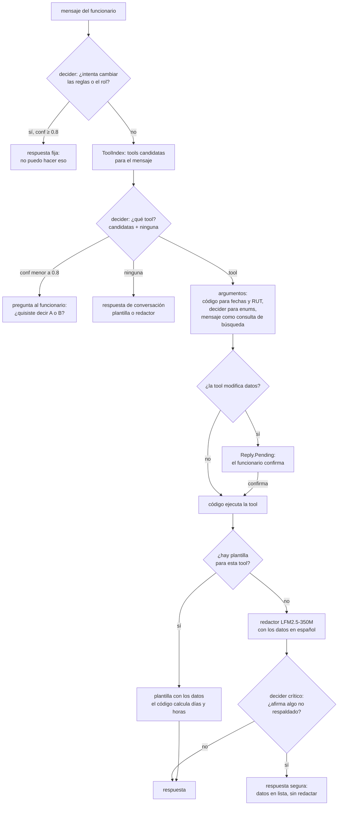

# Flujo híbrido de un turno (propuesta)

Un turno del agente cuando lo conduce un modelo de decisión (`llm.Decider`, decider-0.8b) y el
texto lo escriben plantillas o un redactor pequeño (LFM2.5-350M). El modelo de decisión nunca
escribe texto libre. El código llama a las tools; ningún modelo lo hace. Ver
[HYBRID_DESIGN.md](../HYBRID_DESIGN.md).

