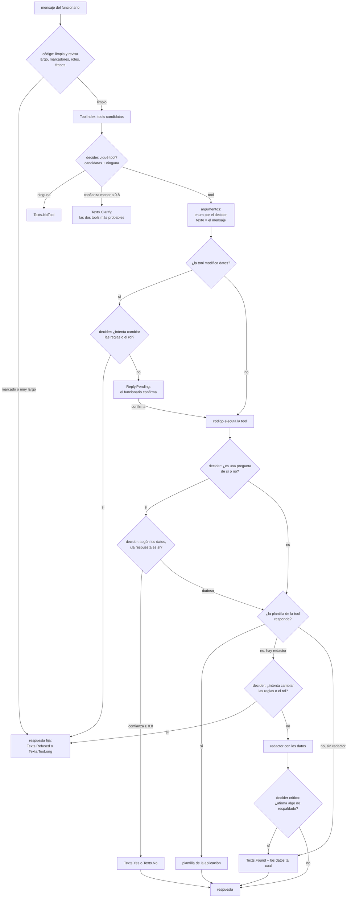

# Flujo híbrido de un turno

Un turno del agente: el código revisa el mensaje, un modelo de decisión (`llm.Decider`,
decider-0.8b) elige, y el texto lo escriben plantillas o un redactor pequeño (LFM2.5-350M). El
modelo de decisión nunca escribe texto libre. El código llama a las tools; ningún modelo lo hace.
Ver [HYBRID_DESIGN.md](../HYBRID_DESIGN.md), sección "La especificación de v1".

