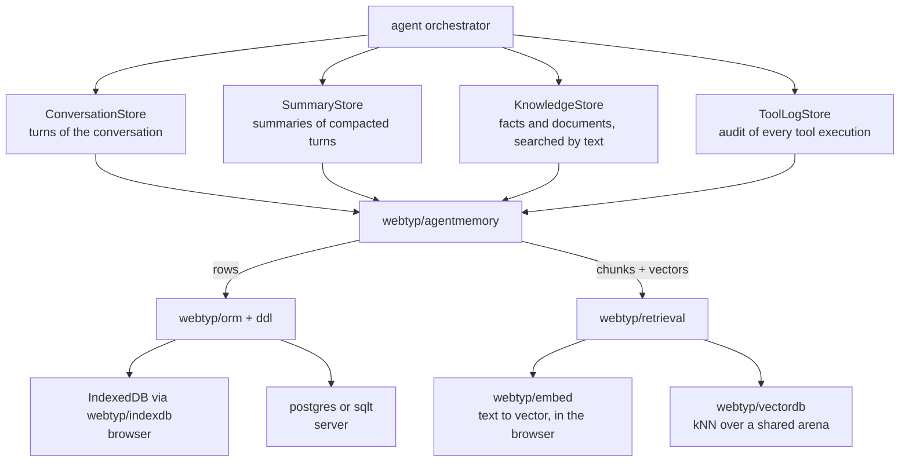

# Memory architecture

The agent declares **what** it needs to remember as four narrow ports. Where it is stored is
decided by the implementation, which is `webtyp/agentmemory` in production and `mem_memory.go`
in tests. The same implementation code runs in the browser (IndexedDB) and on a server (SQL),
because it is written against `orm` + `ddl`, not against a database.

| Port | Kind of memory | Read by |
|---|---|---|
| `ConversationStore` | short-term: the recent turns | `agentcontext.Compile` via the orchestrator |
| `SummaryStore` | compacted history | `agentcontext.Compile` |
| `KnowledgeStore` | long-term semantic memory (global or per session) | the agent's knowledge lookups |
| `ToolLogStore` | action memory: what ran, with what, and how it went | audits and self-correction |

`SearchKnowledge` receives text. Embedding it and searching vectors is done inside the
implementation, which is why the agent never imports `embed` or `vectordb`.
