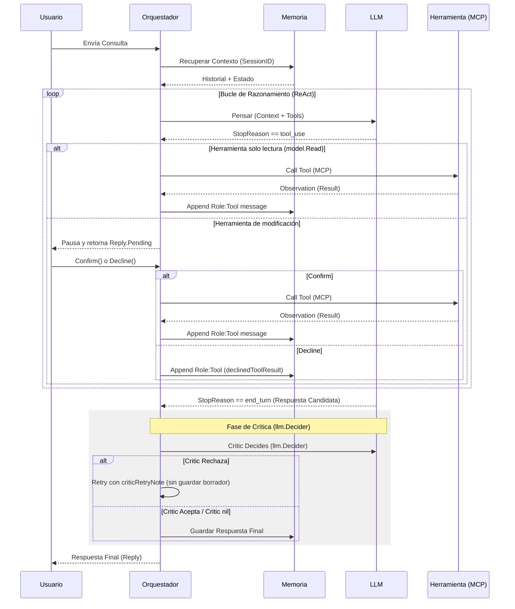

```mermaid
sequenceDiagram
    participant U as Usuario
    participant O as Orquestador
    participant M as Memoria
    participant L as LLM
    participant T as Herramienta (MCP)

    U->>O: Envía Consulta
    O->>M: Recuperar Contexto (SessionID)
    M-->>O: Historial + Estado

    loop Bucle de Razonamiento (ReAct)
        O->>L: Pensar (Context + Tools)
        L-->>O: StopReason == tool_use
        alt Herramienta solo lectura (model.Read)
            O->>T: Call Tool (MCP)
            T-->>O: Observation (Result)
            O->>M: Append Role:Tool message
        else Herramienta de modificación
            O-->>U: Pausa y retorna Reply.Pending
            U->>O: Confirm() o Decline()
            alt Confirm
                O->>T: Call Tool (MCP)
                T-->>O: Observation (Result)
                O->>M: Append Role:Tool message
            else Decline
                O->>M: Append Role:Tool (declinedToolResult)
            end
        end
    end

    L-->>O: StopReason == end_turn (Respuesta Candidata)

    rect rgb(240, 240, 240)
    Note over O,L: Fase de Crítica (llm.Decider)
    O->>L: Critic Decides (llm.Decider)
    alt Critic Rechaza
        O->>O: Retry con criticRetryNote (sin guardar borrador)
    else Critic Acepta / Critic nil
        O->>M: Guardar Respuesta Final
    end
    end

    O-->>U: Respuesta Final (Reply)
```
