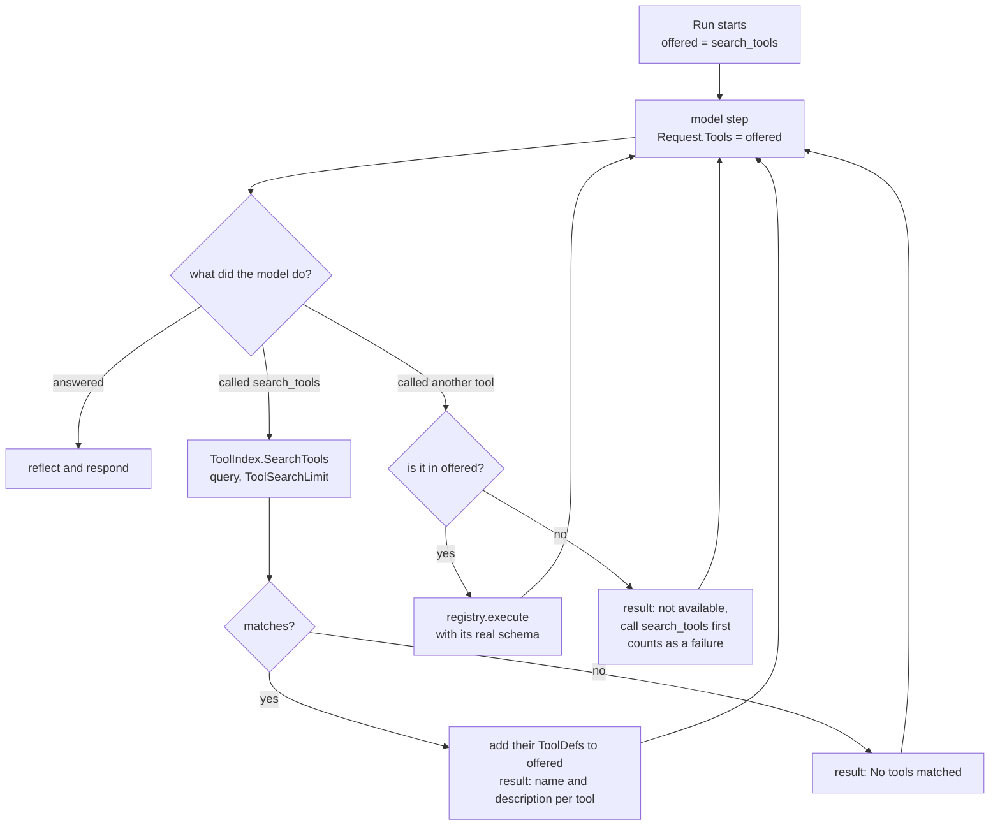

# Tool search

> **STATUS (remove this note when agent v0.6.0 is published):** describes the target of the
> tool-search plan; today every tool is still sent on every step.

The model is not shown every tool. On each step it is offered `search_tools` plus the tools it
already discovered in this `Run`. A tool it has not discovered cannot run, even if the model
names it.

| Branch | Test |
|---|---|
| first step offers only `search_tools` | `TestRun_OffersOnlySearchToolsFirst` |
| search → discovered tool is callable | `TestRun_DiscoveredToolBecomesCallable` |
| undiscovered tool is refused | `TestRun_UndiscoveredToolIsRefused` |
| keyword ranking, limit, no match | `TestMemToolIndex_RanksByMatchedWords`, `TestMemToolIndex_LimitAndNoMatch` |

`ToolIndex` is a port. `NewMemToolIndex` (in this repository) ranks by shared keywords. The
implementation in `webtyp/agentmemory` ranks by meaning, over `webtyp/retrieval`.
