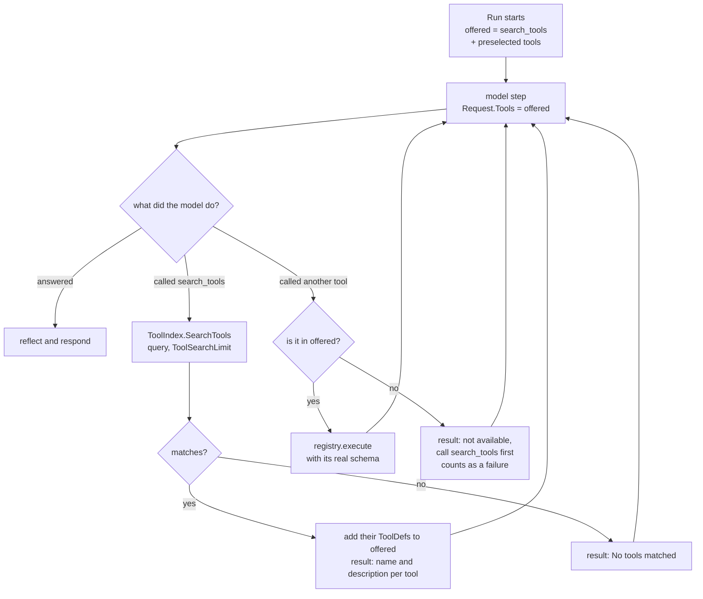

# Tool search

The model is not shown every tool. On each step it is offered `search_tools` plus the tools it
already discovered in this `Run`. A tool it has not discovered cannot run, even if the model
names it.

The model is preselected the tools that match the user's message on the first step, improving tool invocation accuracy without requiring a search hop (e.g. 8–9 of 10 calls on opening-hours benchmark vs 1–2 of 10 without preselection).

| Branch | Test |
|---|---|
| first step offers only `search_tools` | `TestRun_OffersOnlySearchToolsFirst` |
| search → discovered tool is callable | `TestRun_DiscoveredToolBecomesCallable` |
| undiscovered tool is refused | `TestRun_UndiscoveredToolIsRefused` |
| keyword ranking, limit, no match | `TestMemToolIndex_RanksByMatchedWords`, `TestMemToolIndex_LimitAndNoMatch` |
| preselect tools on first step | `TestPreselect_FewTools`, `TestPreselect_ManyToolsKeywordMatch`, `TestPreselect_DirectCallWorks`, `TestPreselect_NegativePreselectToolsError`, `TestPreselect_IndexError` |

`ToolIndex` is a port. `NewMemToolIndex` (in this repository) ranks by shared keywords. The
implementation in `webtyp/agentmemory` ranks by meaning, over `webtyp/retrieval`.
